# Lab 01
## Bài 1: Thiết lập môi trường
### 1.1 Đăng ký tài khoản MongoDB Atlas và tạo cluster miễn phí trên dịch vụ đám mây
Đăng ký tài khoản và tạo cluster thành công

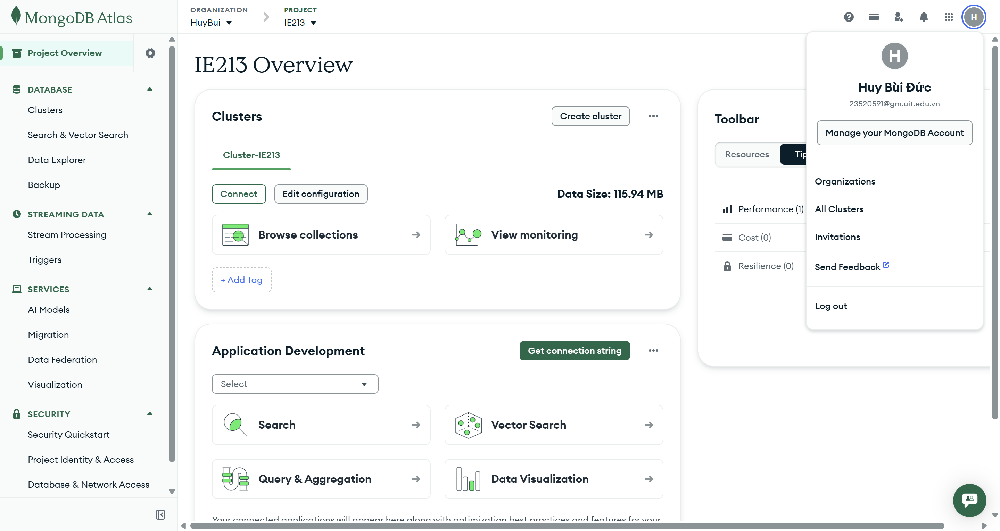

### 1.2 Tìm nạp dữ liệu mẫu trên MongoDB Atlas vào Cluster

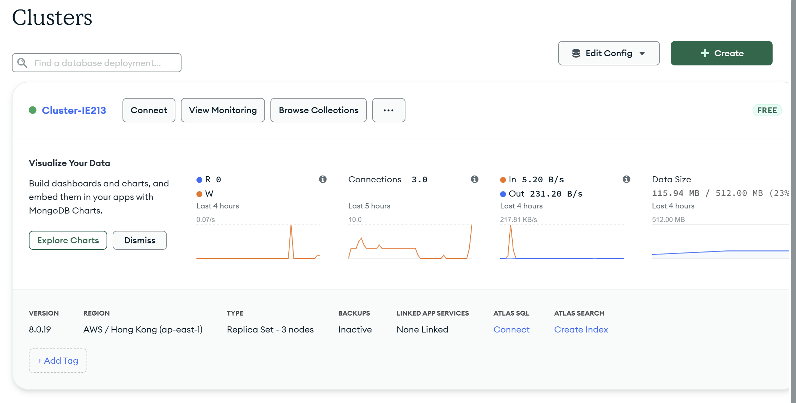

### 1.3 & 1.4 Cài đặt MongoDB Compass trên máy tính và Kết nối MongoDB Compass với cluster đã tạo trên MongoDB
Giao diện khi đã connect thành công

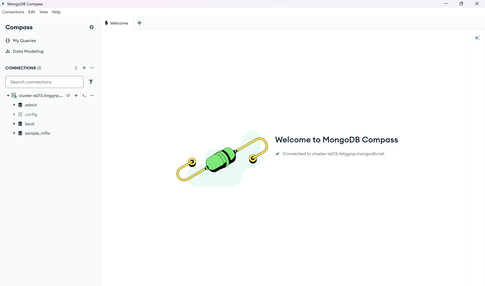

## Bài 2: Thao tác CRUD bằng MONGOSH
### 2.1 Tạo CSDL có tên 23520591-IE213 trên Cluster
Để tạo CSDL mới có tên 23520591-IE213 ta sử dụng lệnh sau:
```
use 23520591-IE213
```
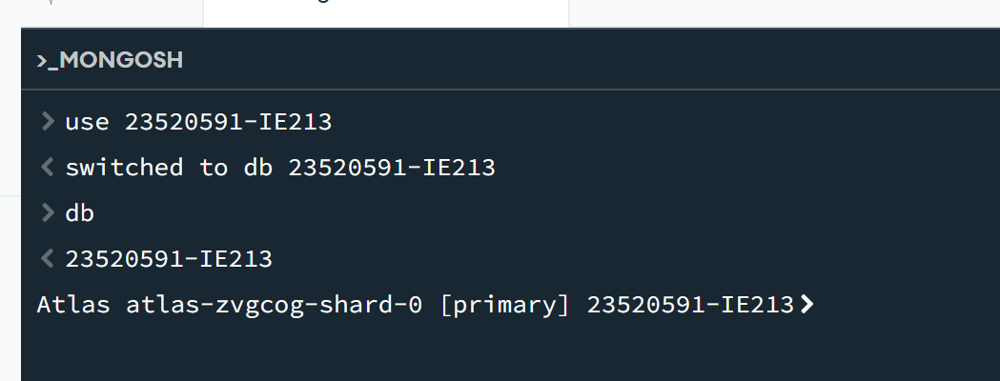

### 2.2 Thêm các document sau đây vào collection có tên là employees trong db vừa được tạo ở trên
```
{"id":1,"name":{"first":"John","last":"Doe"},"age":48}
{"id":2,"name":{"first":"Jane","last":"Doe"},"age":16}
{"id":3,"name":{"first":"Alice","last":"A"},"age":32}
{"id":4,"name":{"first":"Bob","last":"B"},"age":64}
```
Sử dụng insertMany() để thêm các document vào collection:
```
db.employees.insertMany([
  {"id": 1, "name": {"first": "John", "last": "Doe"}, "age": 48},
  {"id": 2, "name": {"first": "Jane", "last": "Doe"}, "age": 16},
  {"id": 3, "name": {"first": "Alice", "last": "A"}, "age": 32},
  {"id": 4, "name": {"first": "Bob", "last": "B"}, "age": 64}
])
```
Kết quả:

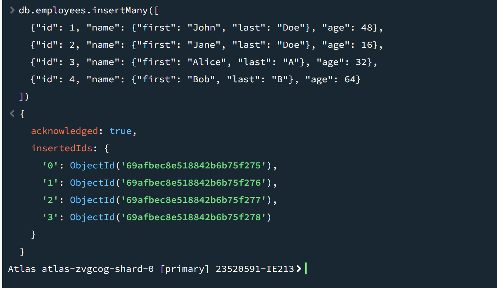

Kiểm tra dữ liệu đã được thêm vào thành công chưa:
```
db.employees.find().pretty()
```
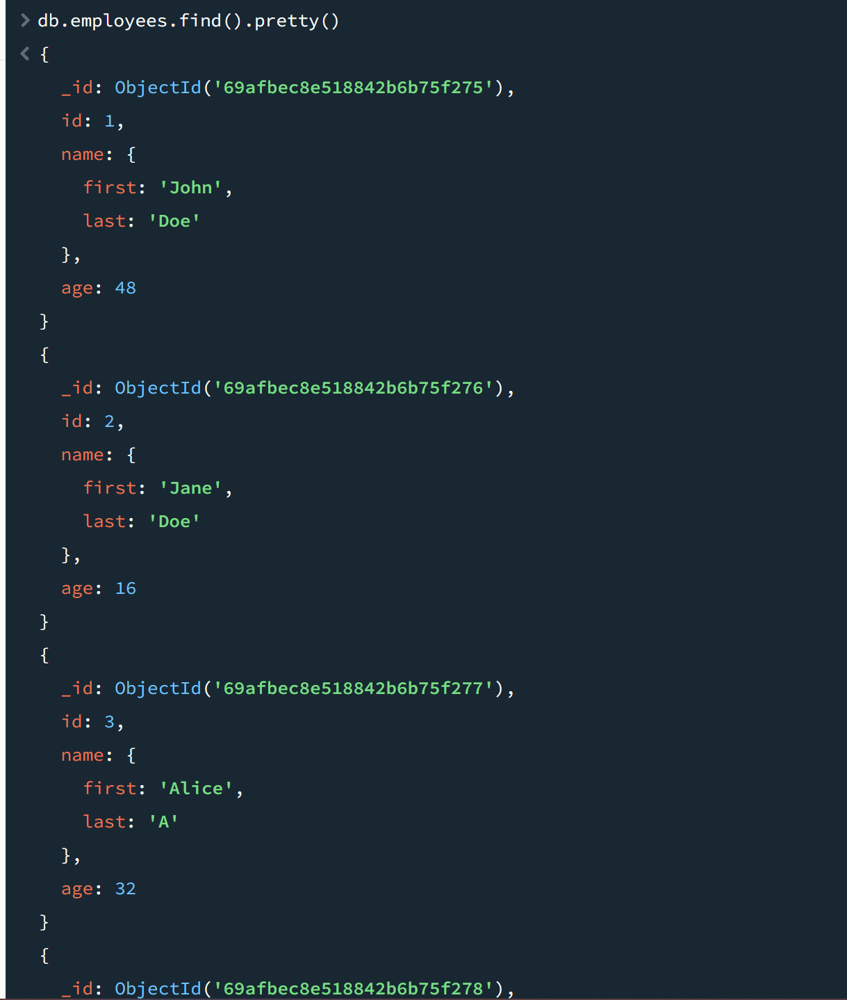
### 2.3 Biến trường id trong các document trên trở thành duy nhất. Có nghĩa là không thể thêm một document mới với giá trị id đã tồn tại.
Sử dụng createIndex() với tùy chọn unique: true để đảm bảo không trùng lặp id.
```
db.employees.createIndex({id: 1}, {unique: true})
```
**Giải thích:**
- db.employees: Chỉ định thao tác trên collection employees.

- createIndex({ id: 1 }, ...): Lệnh này yêu cầu MongoDB tạo một "chỉ mục" (index) trên trường id. Số 1 có nghĩa là sắp xếp theo thứ tự tăng dần.

- {unique: true}: Đây là tham số quan trọng nhất. Nó ra lệnh cho cơ sở dữ liệu rằng: "Mọi giá trị trong trường id này phải là duy nhất". Nếu cố tình thêm một nhân viên có id đã tồn tại, MongoDB sẽ chặn lại và báo lỗi.

Kết quả và kiểm tra:

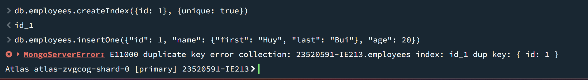

### 2.4 Viết lệnh để tìm document có firstname là John và lastname là Doe.
Sử dụng find() với bộ lọc trên các trường lồng nhau name.first và name.last.
```
db.employees.find({"name.first": "John", "name.last": "Doe"})
```
Kết quả thực thi: 

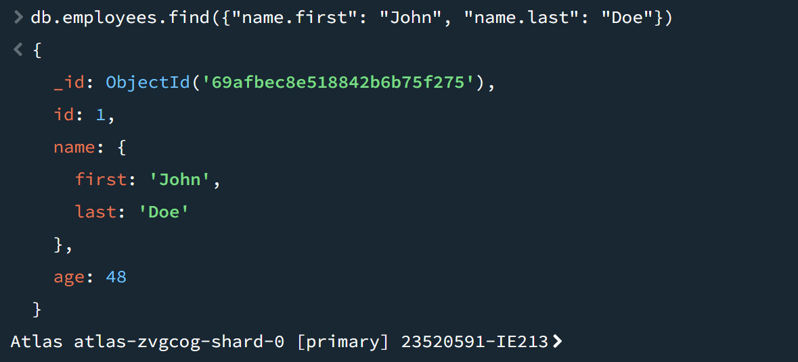

### 2.5 Viết lệnh để tìm những người có tuổi trên 30 và dưới 60.
Sử dụng toán tử so sánh $gt (lớn hơn) và $lt (nhỏ hơn).
```
db.employees.find({
  $and: [
    {age: {$gt: 30}},
    {age: {$lt: 60}}
  ]
})
```
Kết quả thực thi: 

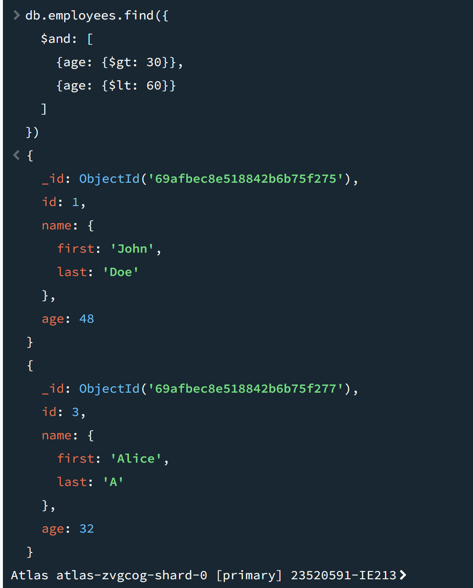

### 2.6 Thêm các document sau đây vào collection:
```
{"id":5,"name":{"first":"Rooney", "middle":"K", "last":"A"},"age":30}
{"id":6,"name":{"first":"Ronaldo", "middle":"T", "last":"B"},"age":60}
```
### Sau đó viết lệnh để tìm tất cả các document có middle name.

Để thêm các document trên ta sử dụng lệnh:
```
db.employees.insertMany([
  {"id": 5, "name": {"first": "Rooney", "middle": "K", "last": "A"}, "age": 30},
  {"id": 6, "name": {"first": "Ronaldo", "middle": "T", "last": "B"}, "age": 60}
])
```
Kết quả thực thi:

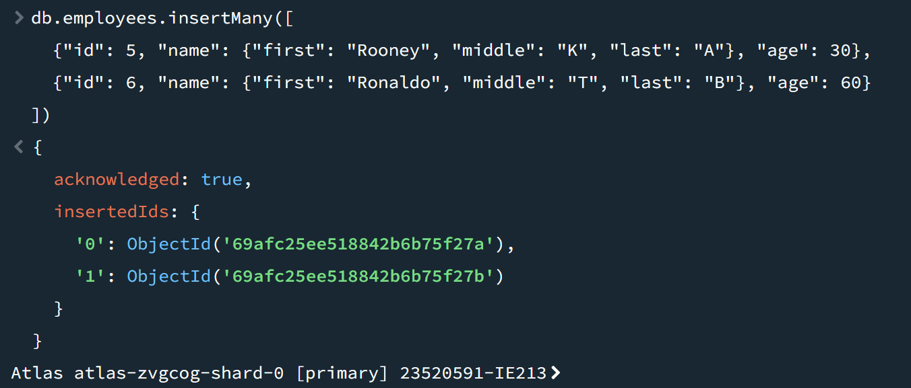

Để tìm các document có middle name ta sử dụng lệnh find() với toán tử $exist: true:
```
db.employees.find({"name.middle": {$exists: true}})
```
Kết quả thực thi: 

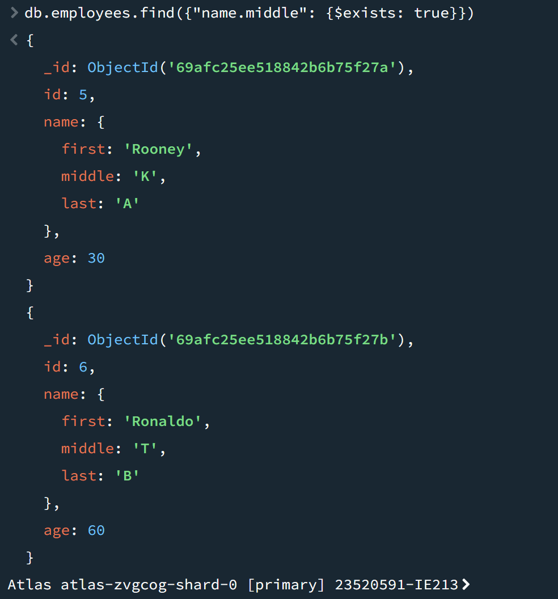

### 2.7 Cho rằng là những document nào đang có middle name là không đúng, hãy xoá middle name ra khỏi các document đó.
Sử dụng $unset để xóa trường middle name khỏi các document:
```
db.employees.updateMany(
  {"name.middle": {$exists: true}},
  {$unset: {"name.middle": ""}}
)
```
Kết quả thực thi và kiểm tra:

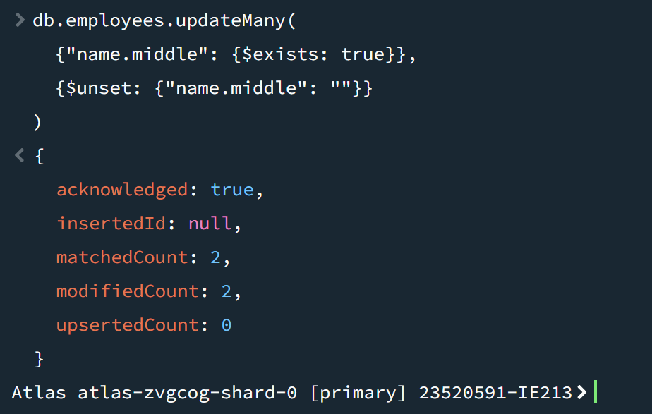

### 2.8 Thêm trường dữ liệu organization: "UIT" vào tất cả các document trong employees collection.
Thêm trường organization: "UIT" cho tất cả nhân viên bằng updateMany() và $set:
```
db.employees.updateMany({}, {$set: {organization: "UIT"}})
```
Kết quả thực thi:

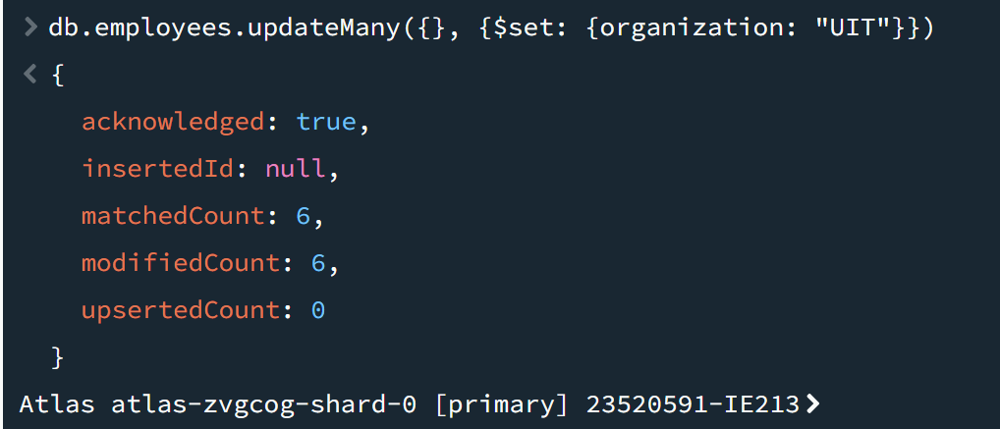

### 2.9 Hãy điều chỉnh organization của nhân viên có id là 5 và 6 thành "USSH".
Dùng updateMany() trong đó dùng toán tử $set với cặp khoá – giá trị là organization: "USSH" với các document có id 5 và 6:
```
db.employees.updateMany(
  {id: {$in: [5, 6]}}, 
  {$set: {organization: "USSH"}}
)
```
Kết quả thực thi:

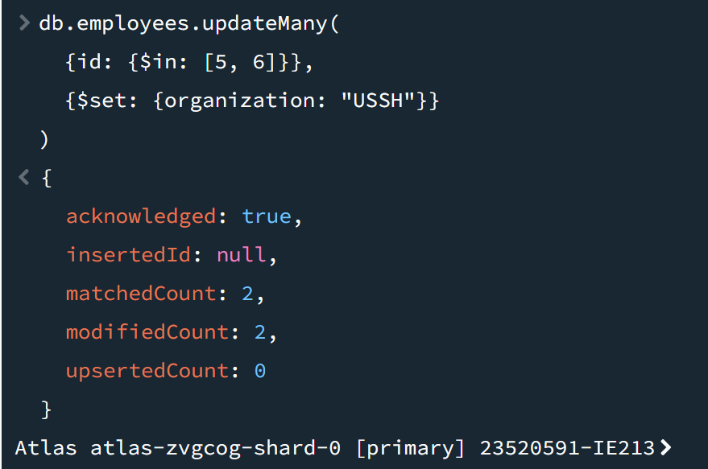

### 2.10 Viết lệnh để tính tổng tuổi và tuổi trung bình của nhân viên thuộc 2 organization là UIT và USSH.
Sử dụng aggregate() kết hợp $group để tính tổng tuổi và tuổi trung bình theo từng tổ chức.
```
db.employees.aggregate([
  {
    $group: {
      _id: "$organization",
      totalAge: {$sum: "$age"},
      averageAge: {$avg: "$age"}
    }
  }
])
```
**Giải thích:** 
- ```_id: "$organization"```: Nhóm heo trường organization.
- ```$sum```: Toán tử tích lũy dùng để cộng dồn giá trị của trường age.
- ```$avg```: Toán tử tích lũy dùng để tính toán giá trị trung bình của trường age.

Kết quả thực thi:

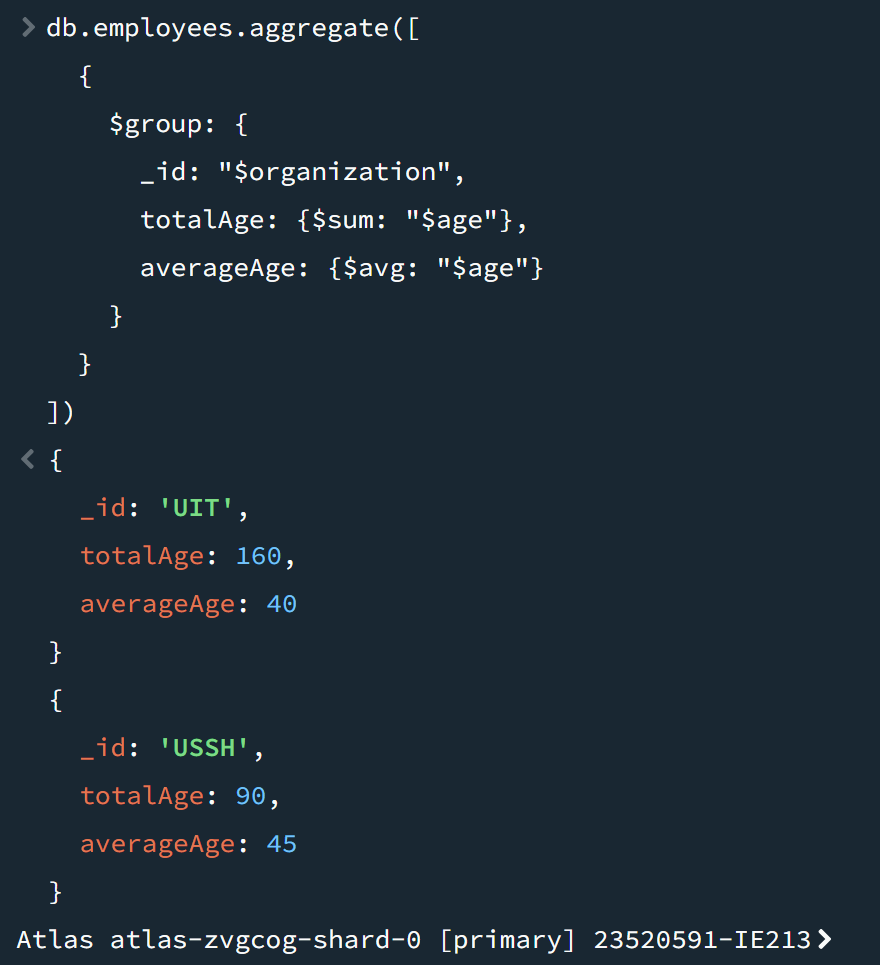
