# Lab 02: Thiết lập Backend với Node.js + ExpressJS

---

## 1. Thông tin sinh viên
**Họ và tên:** Bùi Đức Huy  
**MSSV:** 23520591  
**Lớp:** IE213.Q21  
**Giảng viên:** ThS. Võ Tấn Khoa

---

## 2. Mục tiêu của bài lab
- Thiết lập môi trường backend hoàn chỉnh với Node.js và Express.
- Kết nối ứng dụng với cơ sở dữ liệu MongoDB Atlas (database `sample_mflix`).
- Xây dựng kiến trúc **DAO – Controller – Route** theo mô hình 3 tầng.
- Triển khai RESTful API cơ bản để lấy danh sách phim (`/api/v1/movies`) với các tính năng:
  - Phân trang
  - Lọc theo `title` và `rated`

---

## 3. Công cụ và môi trường sử dụng
- **Ngôn ngữ & Framework**: Node.js (v24.12.0), Express.js (^4.19.2)
- **Database**: MongoDB Atlas (MongoDB driver ^6.8.0)
- **Công cụ hỗ trợ**:
  - dotenv (quản lý biến môi trường)
  - cors (cho phép gọi từ frontend)
  - nodemon (dev server tự động restart)
- **Môi trường phát triển**: Visual Studio Code
- **Hệ điều hành**: Windows 11

---

## 4. Cấu trúc thư mục Lab02
Dưới đây là cấu trúc thư mục backend được tổ chức rõ ràng theo mô hình 3 tầng (Route – Controller – DAO):

```plaintext
Lab02/
├── README.md                             ← Tài liệu mô tả chi tiết bài lab (file này)
├── Screenshots/
└── movie-reviews/
    └── backend/                          ← Thư mục chính của bài lab
        ├── api/                          ← Chứa định tuyến và xử lý logic
        │   ├── movies.route.js           ← Định tuyến API (router.route('/'))
        │   └── movies.controller.js      ← Controller: nhận request, gọi DAO, trả JSON
        ├── dao/                          ← Lớp truy cập dữ liệu
        │   └── moviesDAO.js              ← MoviesDAO: kết nối collection 'movies' + getMovies()
        ├── index.js                      ← File khởi động chính: kết nối MongoDB + chạy server
        ├── server.js                     ← Khởi tạo Express app + middleware (cors, json, 404)
        ├── package.json                  ← Quản lý dependencies và script "npm run dev"
        ├── package-lock.json             ← File lock (tự động tạo khi npm install)
        └── .env                          ← Biến môi trường (DB_URI, PORT)
```

## 5. Cách chạy chương trình
1. Vào thư mục
```bash
cd Lab02/movie-reviews/backend
```
2. Cài đặt packages:
```bash
npm install
```
3. Tạo file .env
```bash
MOVIEREVIEWS_DB_URI=<mongodb_atlas_uri>
MOVIEREVIEWS_NS=sample_mflix
PORT=8000
```
4. Chạy server:
```bash
npm rundev
```
5. Truy cập API: `http://localhost:8000/api/v1/movies`

## 6. Kết quả thực hiện
- Server chạy thành công trên port 8000.
- Kết nối MongoDB Atlas thành công.
- API trả về JSON đúng định dạng (danh sách phim + phân trang + filter).
- Hoàn thành 100% yêu cầu trong file hướng dẫn bài thực hành.

## 7. Các công việc và nội dung đã thực hiện
**Bài 1: Thiết lập môi trường**
- Tải và cài đặt Node.js, kiểm tra thành công với lệnh `node -v`

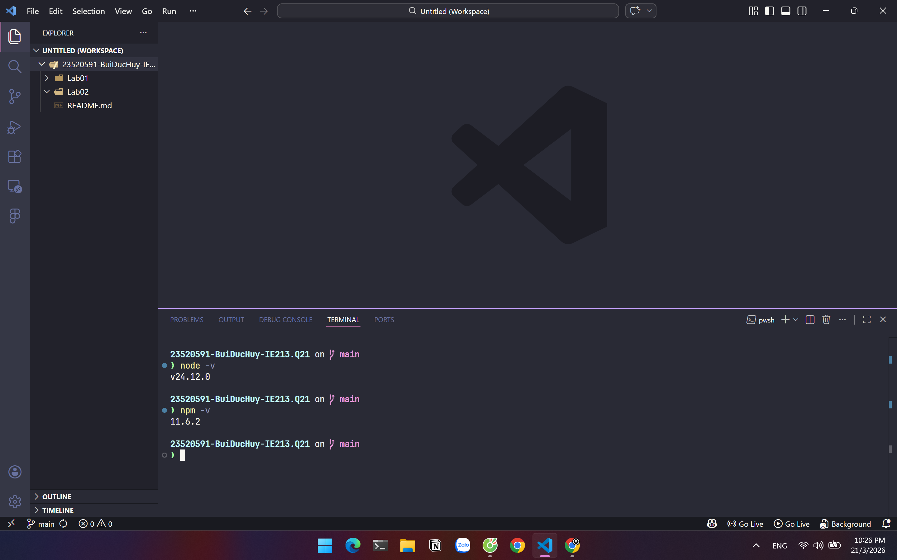

- Cài đặt Visual Studio Code
- Khởi tạo cây thư mục dự án: `movie-reviews/backend`
- Chạy `npm init -y` để tạo `package.json`

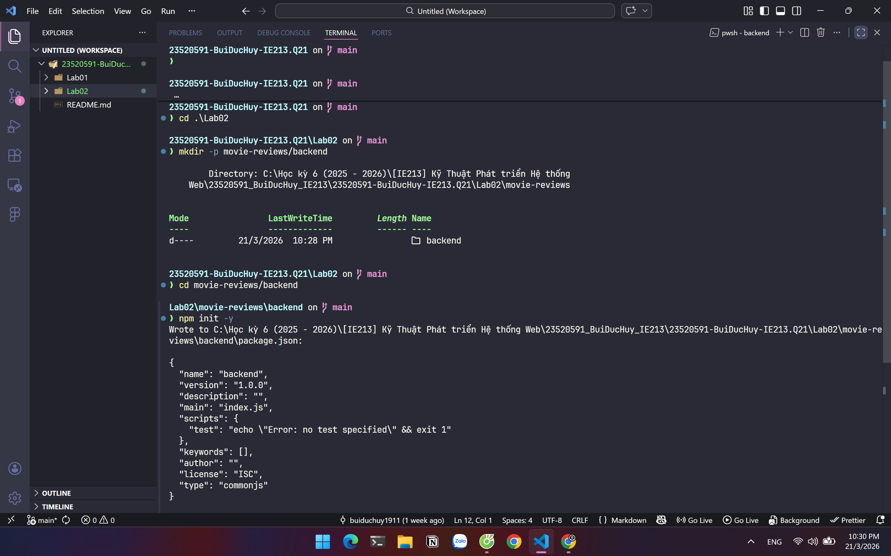

- Cài đặt các dependency: `express`, `cors`, `dotenv`, `mongodb`


- Cài đặt `nodemon` và cấu hình script `"dev": "nodemon index.js"`

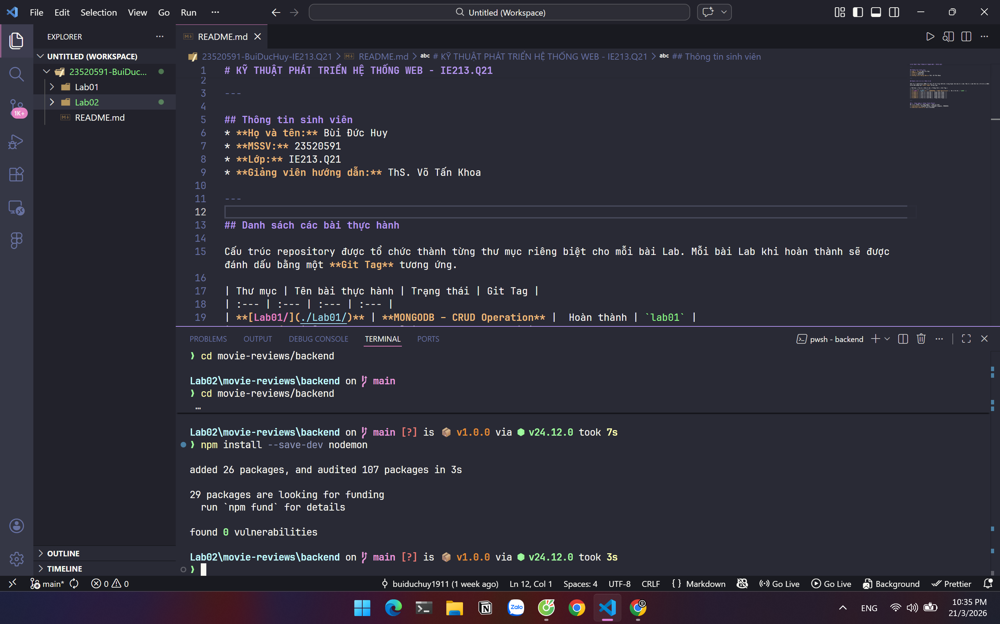

- Thêm `"type": "module"` vào `package.json` để sử dụng ES6 import/export

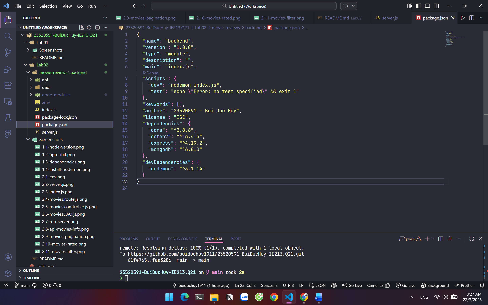

**Bài 2: Xây dựng backend**
- Tạo file `server.js`: khởi tạo Express app, thêm middleware cors + express.json, mount route `/api/v1/movies`, xử lý lỗi 404
 
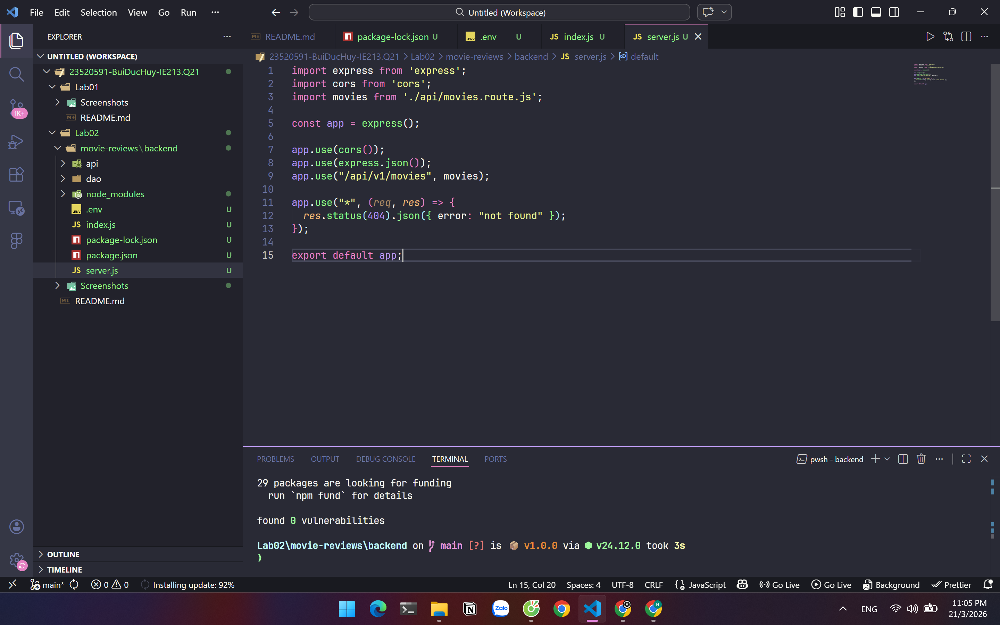

- Tạo file `.env`: lưu biến `MOVIEREVIEWS_DB_URI`, `MOVIEREVIEWS_NS=sample_mflix`, `PORT=8000`

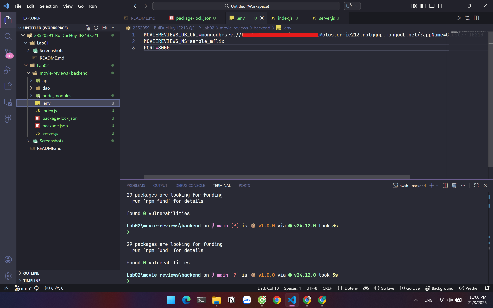

- Tạo file `index.js`: kết nối MongoDB Atlas, gọi `MoviesDAO.injectDB()`, chạy server

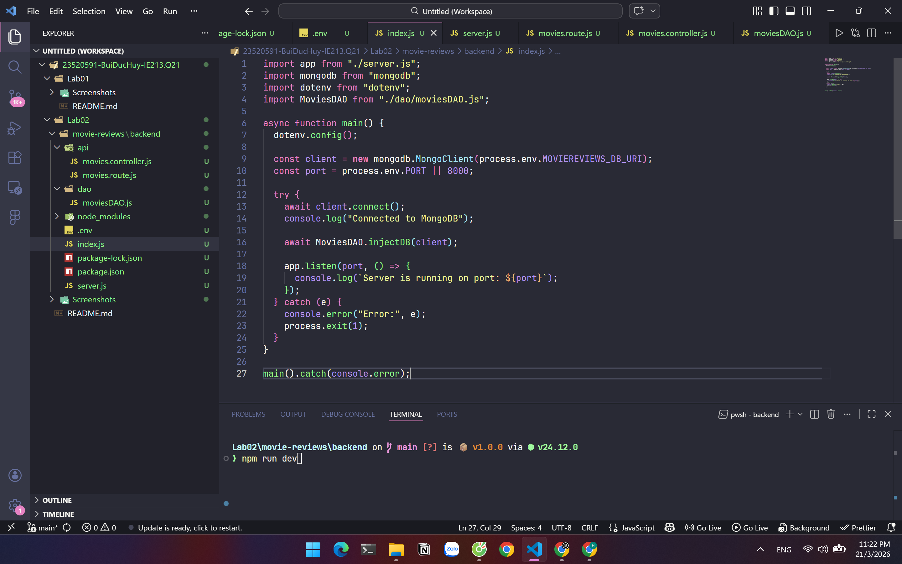

- Tạo thư mục `api/` và các file route + controller

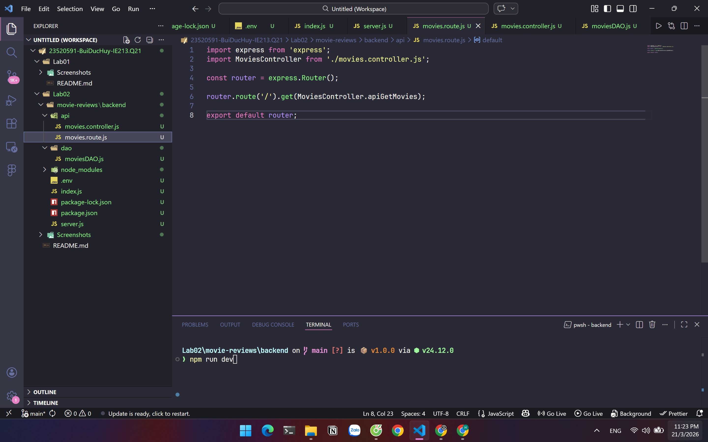
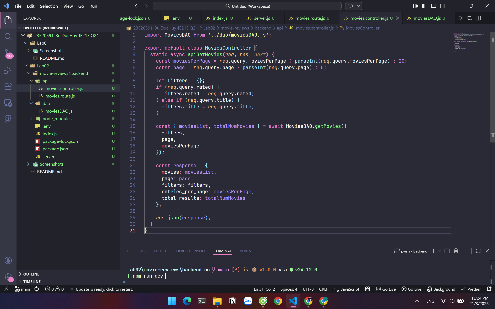

- Tạo thư mục `dao/` và file `moviesDAO.js` (injectDB + getMovies)

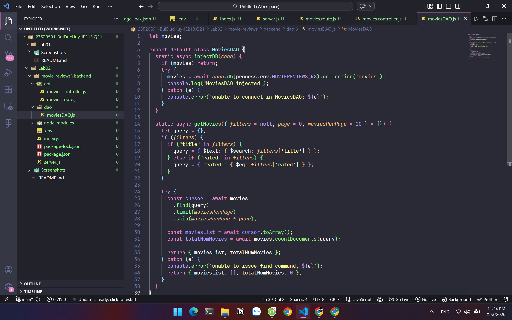

- Cập nhật route để sử dụng Controller (`MoviesController.apiGetMovies`)
- Fix lỗi thực tế: hạ Express từ v5 xuống v4, reinstall dependencies
- Chạy server:

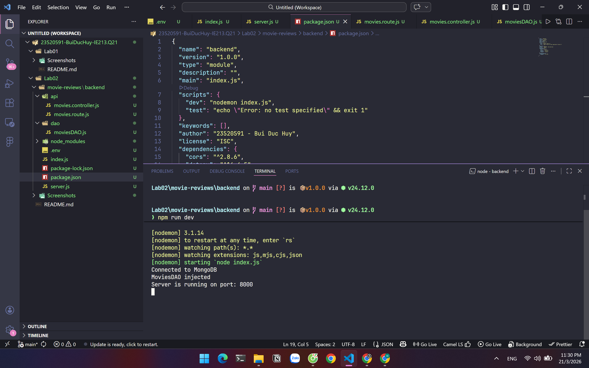

***Chạy thử kết quả***
- API trả danh sách phim:

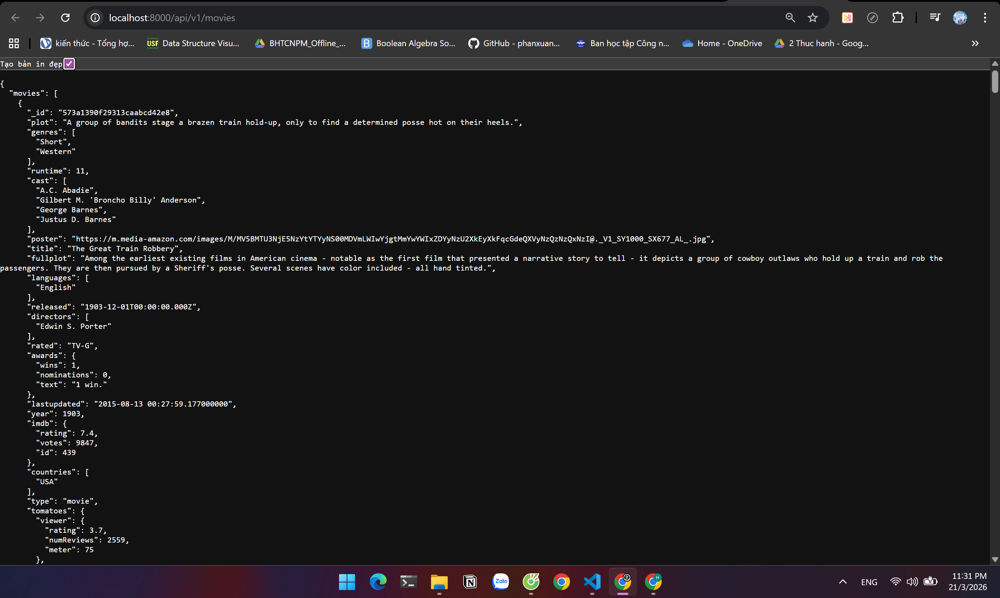

- Lọc theo phân trang:

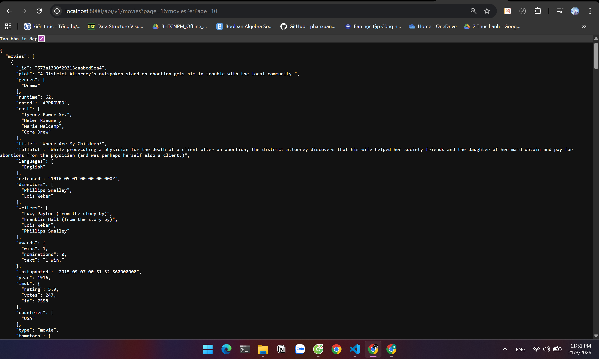

- Lọc theo rated:

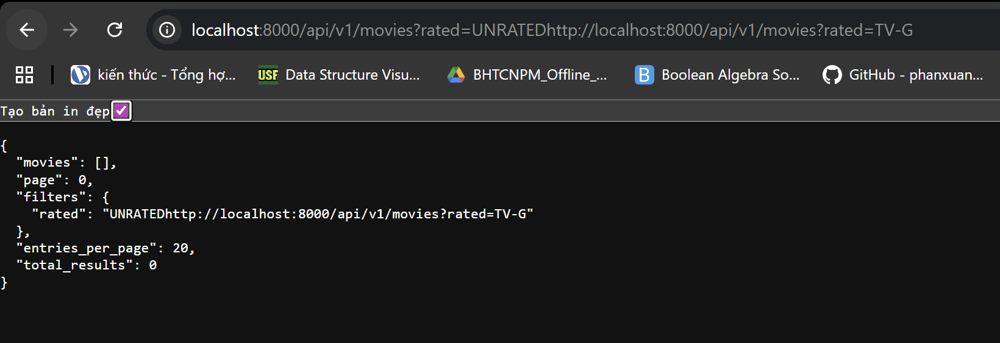

- Lọc theo tên phim:

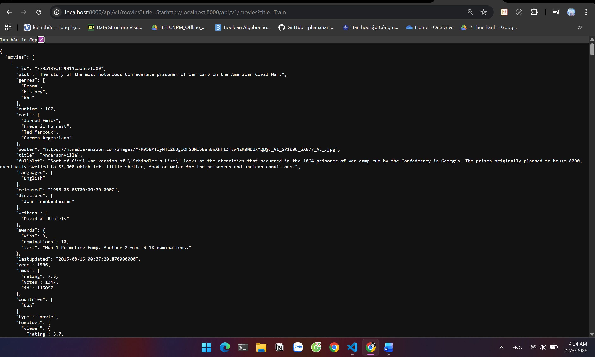
