# Lab 03: Mở rộng Backend Movie Reviews (Movie Detail + Ratings + Reviews CRUD)

---

## 1. Thông tin sinh viên
**Họ và tên:** Bùi Đức Huy  
**MSSV:** 23520591  
**Lớp:** IE213.Q21  
**Giảng viên:** ThS. Võ Tấn Khoa

---

## 2. Mục tiêu của bài lab
- Tiếp tục phát triển backend từ Lab02 theo kiến trúc Route - Controller - DAO.
- Bổ sung API lấy thông tin chi tiết phim theo `id`.
- Bổ sung API lấy danh sách các mức `rated` có trong dữ liệu.
- Triển khai các API thao tác `review` (thêm, sửa, xóa).
- Kiểm thử đầy đủ các endpoint theo yêu cầu bài Lab03.

---

## 3. Công cụ và môi trường sử dụng
- **Ngôn ngữ & Framework**: Node.js (v24.12.0), Express.js (^4.19.2)
- **Database**: MongoDB Atlas (MongoDB driver ^6.8.0)
- **Công cụ hỗ trợ**:
  - dotenv (quản lý biến môi trường)
  - cors (cho phép gọi API từ frontend/client)
  - nodemon (tự động restart server khi code thay đổi)
- **Môi trường phát triển**: Visual Studio Code
- **Hệ điều hành**: Windows 11

---

## 4. Cấu trúc thư mục Lab03

```plaintext
Lab03/
├── README.md
├── Screenshots/
└── movie-reviews/
    └── backend/
        ├── api/
        │   ├── movies.route.js
        │   ├── movies.controller.js
        │   └── reviews.controller.js
        ├── dao/
        │   ├── moviesDAO.js
        │   └── reviewsDAO.js
        ├── index.js
        ├── server.js
        ├── package.json
        ├── package-lock.json
        └── .env
```

---

## 5. Cách chạy chương trình
1. Vào thư mục backend:

```bash
cd Lab03/movie-reviews/backend
```

2. Cài đặt packages:

```bash
npm install
```

3. Tạo file `.env`:

```env
MOVIEREVIEWS_DB_URI=<mongodb_atlas_uri>
MOVIEREVIEWS_NS=sample_mflix
PORT=8000
```

4. Chạy server:

```bash
npm run dev
```

5. Base URL để test API:

```text
http://localhost:8000/api/v1/movies
```

---

## 6. Kết quả thực hiện
- Server chạy ổn định trên port 8000.
- Kết nối MongoDB Atlas thành công.
- Inject thành công cả `movies` collection và `reviews` collection.
- Hoàn thành đầy đủ các API mở rộng theo yêu cầu của Lab03.

---

## 7. Các công việc và nội dung đã thực hiện

### 7.1. Mở rộng route và controller
- Thêm endpoint `GET /ratings` để lấy toàn bộ mức phân loại phim.
- Thêm endpoint `GET /id/:id` để lấy chi tiết phim và danh sách reviews.
- Thêm endpoint `POST /review` để thêm review mới.
- Thêm endpoint `PUT /review` để sửa nội dung review.
- Thêm endpoint `DELETE /review` để xóa review.

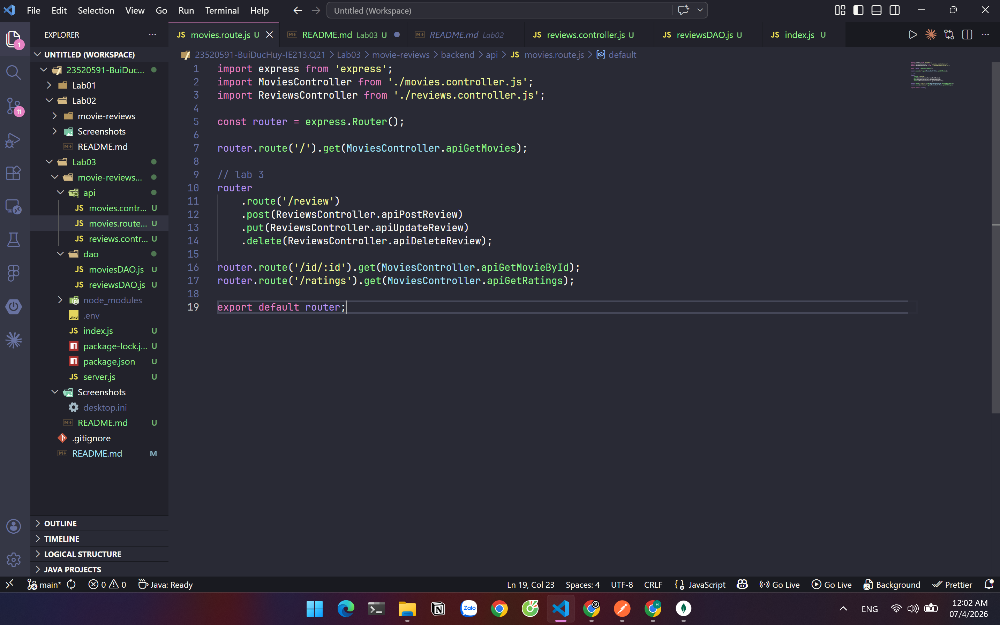

### 7.2. Mở rộng DAO
- Trong `moviesDAO.js`:
  - Bổ sung hàm `getMovieById(id)` dùng `$lookup` để join với collection `reviews`.
  - Bổ sung hàm `getRatings()` dùng `distinct("rated")`.

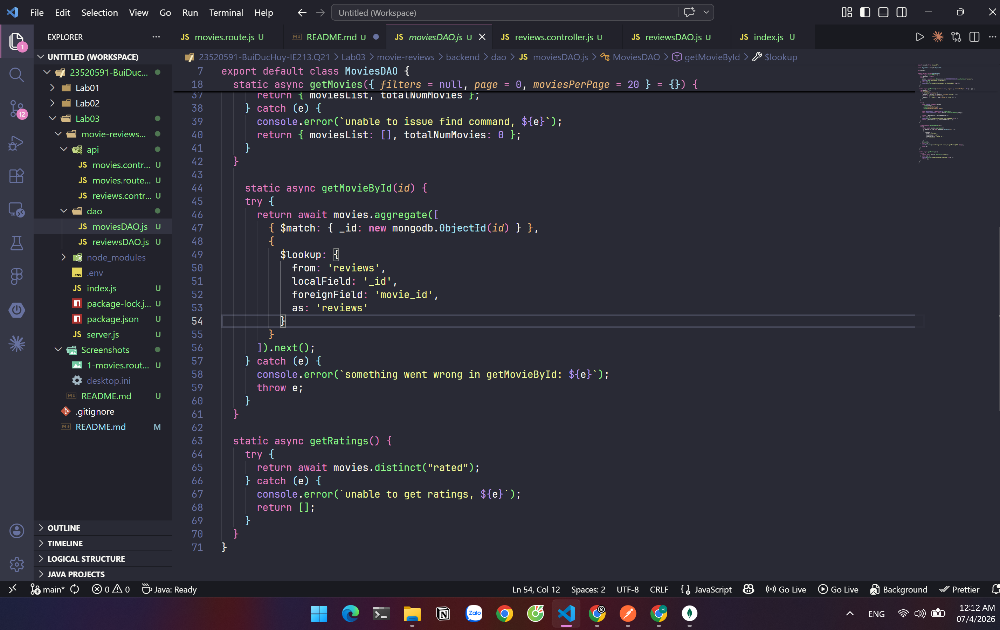

- Trong `reviewsDAO.js`:
  - Bổ sung `addReview(...)`.
  - Bổ sung `updateReview(...)`.
  - Bổ sung `deleteReview(...)`.

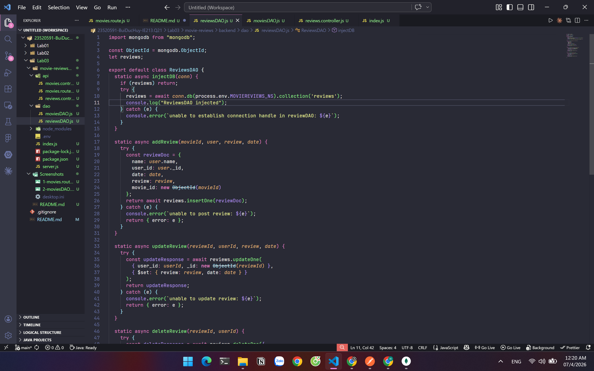

### 7.3. Danh sách API đã test thành công
1. **GET All Ratings**  
`GET /api/v1/movies/ratings`

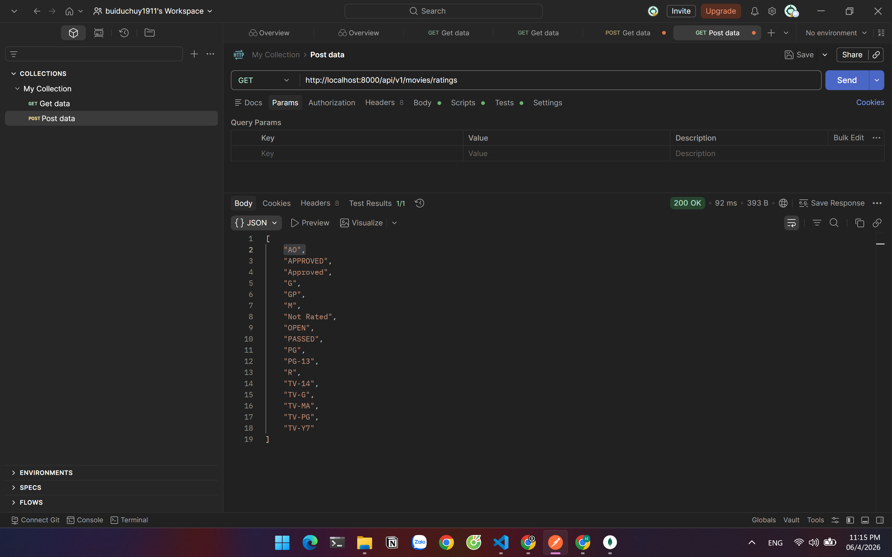

2. **POST - Thêm review**  
`POST /api/v1/movies/review`

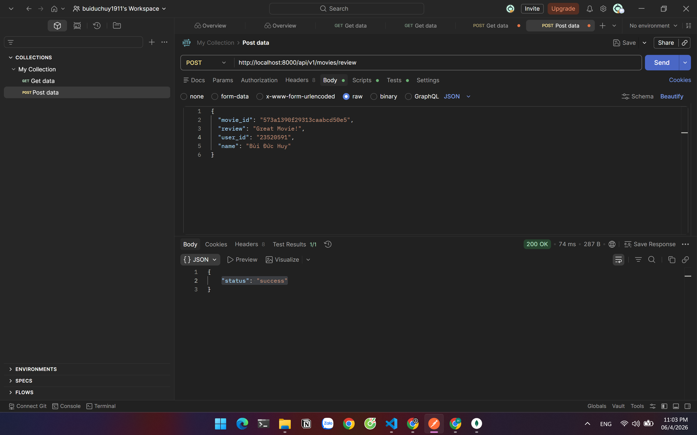
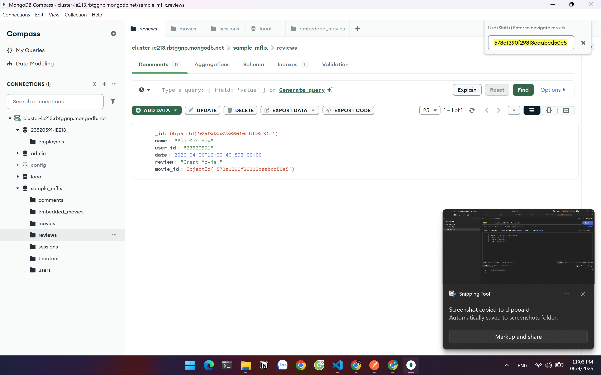

3. **GET Movie by ID + Reviews**  
`GET /api/v1/movies/id/:id`

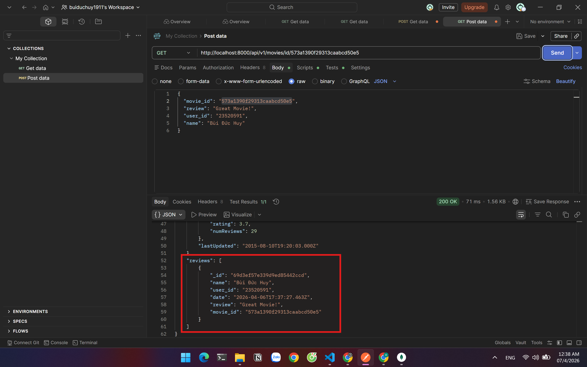

4. **PUT - Sửa Review**  
`PUT /api/v1/movies/review`

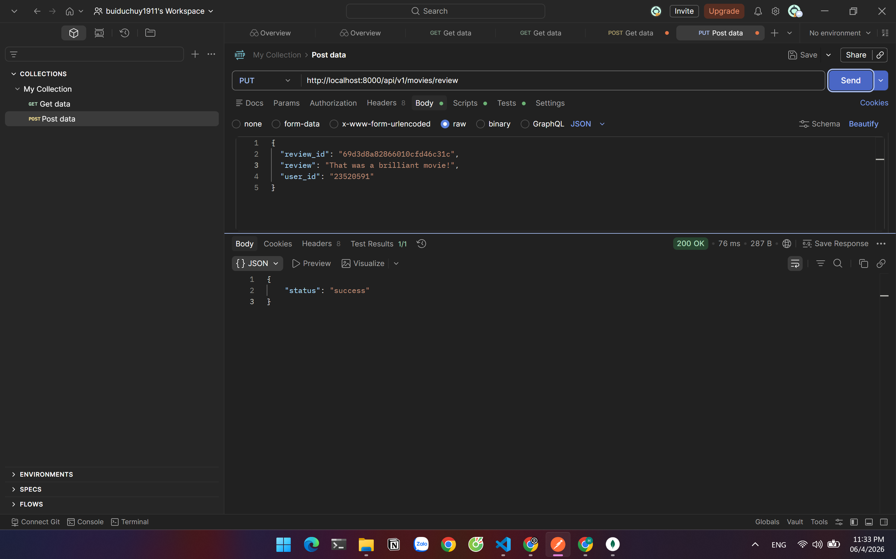
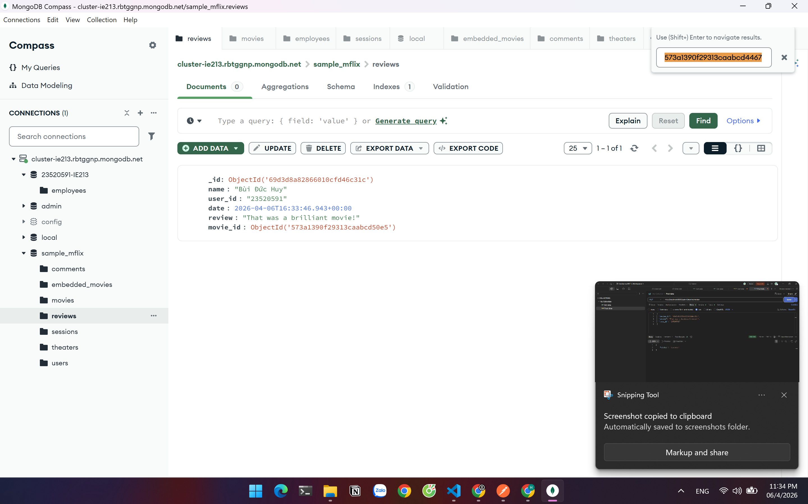

5. **DELETE - Xóa Review**  
`DELETE /api/v1/movies/review`

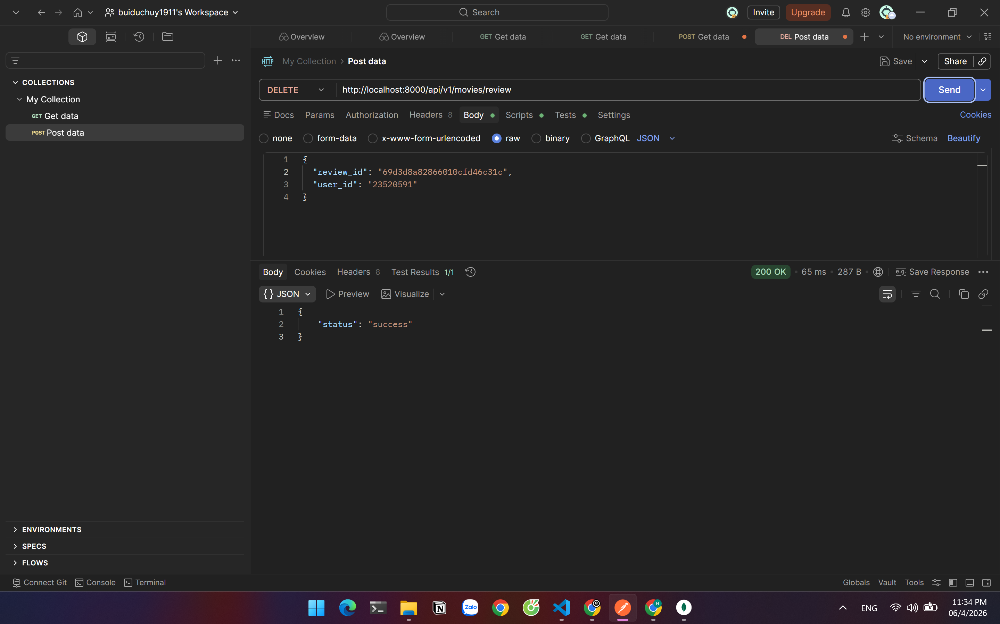
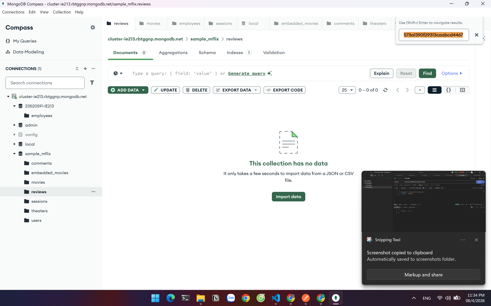