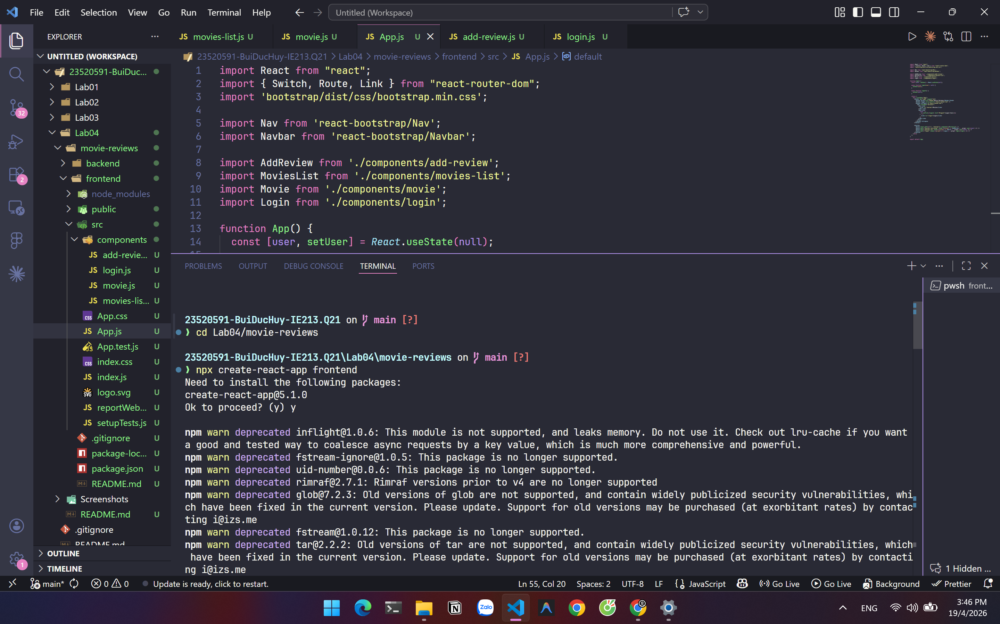
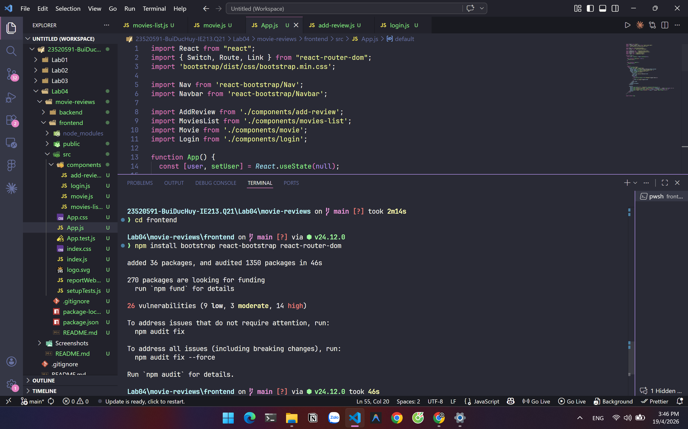
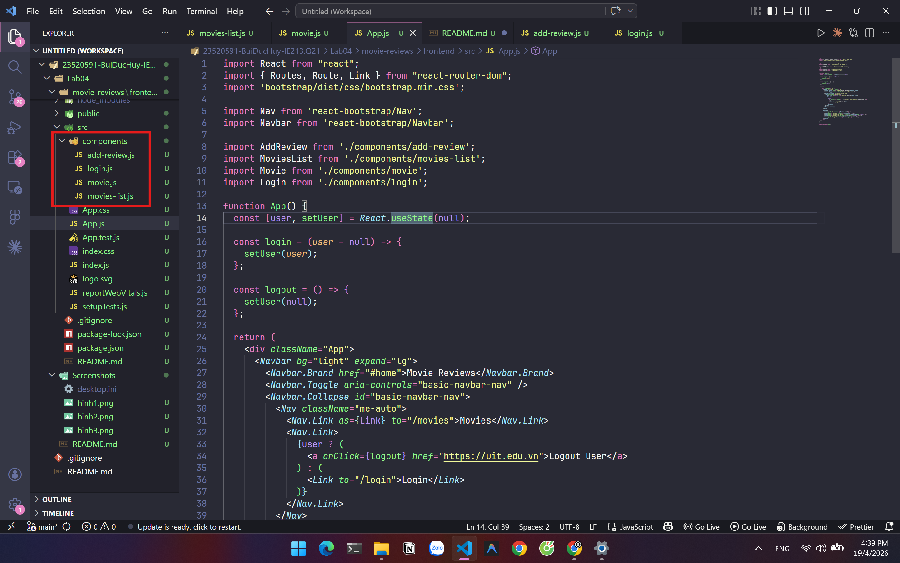
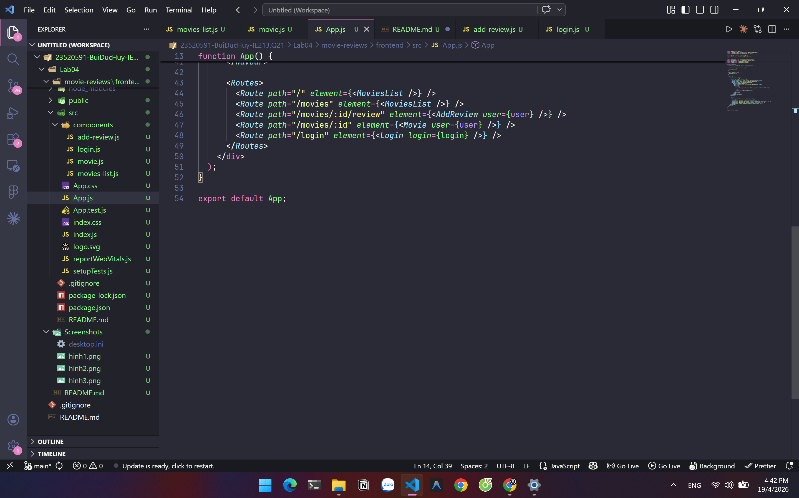
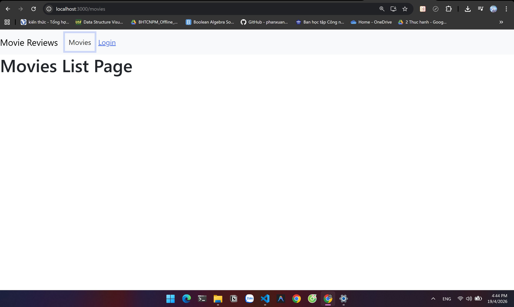

# Lab 04: Xây dựng Frontend Movie Reviews (React + React Router)

---

## 1. Thông tin sinh viên
**Họ và tên:** Bùi Đức Huy  
**MSSV:** 23520591  
**Lớp:** IE213.Q21  
**Giảng viên:** ThS. Võ Tấn Khoa

---

## 2. Mục tiêu của bài lab
- Khởi tạo giao diện frontend cho hệ thống Movie Reviews bằng React.
- Tổ chức điều hướng trang bằng React Router.
- Tạo khung các màn hình chính:
	- Movies List
	- Movie Detail
	- Add Review
	- Login
- Kết nối frontend với backend đã xây dựng ở các Lab trước (Lab03) để sẵn sàng tích hợp dữ liệu.

---

## 3. Công cụ và môi trường sử dụng
- **Ngôn ngữ & Framework**: JavaScript, React (^19.2.5)
- **Routing**: react-router-dom (^7.14.1)
- **UI Library**: Bootstrap (^5.3.8), React-Bootstrap (^2.10.10)
- **Build Tool**: react-scripts (5.0.1)
- **Hệ điều hành**: Windows 11

---

## 4. Cấu trúc thư mục Lab04

```plaintext
Lab04/
├── README.md
├── Screenshots/
└── movie-reviews/
		└── frontend/
				├── public/
				├── src/
				│   ├── components/
				│   │   ├── add-review.js
				│   │   ├── login.js
				│   │   ├── movie.js
				│   │   └── movies-list.js
				│   ├── App.js
				│   ├── index.js
				│   └── ...
				├── package.json
				└── package-lock.json
```

---

## 5. Cách chạy chương trình

### Chạy frontend
1. Di chuyển vào thư mục frontend:

```bash
cd Lab04/movie-reviews/frontend
```

2. Cài đặt thư viện:

```bash
npm install
```

3. Chạy ứng dụng frontend:

```bash
npm start
```

4. Mở trình duyệt tại:

```text
http://localhost:3000
```
---

## 6. Kết quả thực hiện
- Frontend React khởi chạy thành công trên cổng 3000.
- Điều hướng nhiều trang hoạt động với React Router.
- Thanh điều hướng gồm các mục Movies và Login/Logout.
- Đã cấu hình Router theo cú pháp tương thích phiên bản `react-router-dom` hiện tại (`Routes`, `Route`, `BrowserRouter`).
- Các màn hình khung được tạo đầy đủ để sẵn sàng tích hợp API ở bước tiếp theo.

---

## 7. Các công việc và nội dung đã thực hiện

### 7.1. Khởi tạo frontend React
- Tạo dự án frontend trong `movie-reviews/frontend`.



- Cài đặt các dependencies cần thiết: React, React Router, Bootstrap, React-Bootstrap.



### 7.2. Xây dựng Navigation Header Bar
- Tạo thư mục `components`
- Tạo 4 component: `movies-list.js`, `movie.js`, `add-review.js`, `login.js`
- Thiết kế Navbar sử dụng React-Bootstrap
- Sử dụng `useState` để quản lý trạng thái user (Login/Logout)



### 7.3. Thiết lập các định tuyến
- Sử dụng `<Routes>` và `<Route>` trong `App.js`
- Định tuyến cho 4 trang chính:
    - `/` và `/movies` → MoviesList
    - `/movies/:id` → Movie
    - `/movies/:id/review` → AddReview
    - `/login` → Login



### 7.4. Điều chỉnh tương thích phiên bản Router
- Sửa lỗi import `Switch` (không còn dùng trong router mới).
- Chuyển sang dùng `Routes` và `element` để ứng dụng chạy ổn định.

### 7.4. Kết quả chạy ứng dụng



---
