# Lab 05: Xây dựng Frontend với ReactJS - Kết nối API Backend

---

## 1. Thông tin sinh viên
**Họ và tên:** Bùi Đức Huy  
**MSSV:** 23520591  
**Lớp:** IE213.Q21  
**Giảng viên:** ThS. Võ Tấn Khoa

---

## 2. Mục tiêu của bài lab
- Kết nối frontend React với backend sử dụng `axios`.
- Xây dựng file dịch vụ (`services/movies.js`) gọi các API endpoint từ backend.
- Cập nhật Component `MoviesList` để lấy dữ liệu phim, danh sách rating, thực hiện chức năng tìm kiếm (theo title, rating) và hiển thị lưới danh sách phim bằng `Card` của React-Bootstrap.
- Cập nhật Component `Movie` hiển thị thông tin chi tiết phim khi nhấn vào phần xem review.
- Hiển thị danh sách các đánh giá (Reviews) bên dưới phần nội dung tóm tắt (Plot) của bộ phim và định dạng lại ngày giờ hiển thị sử dụng thư viện `moment`.

---

## 3. Công cụ và môi trường sử dụng
- **Ngôn ngữ & Framework**: JavaScript, React
- **Thư viện gọi API**: axios
- **UI Library**: Bootstrap, React-Bootstrap
- **Xử lý thời gian**: moment

---

## 4. Cấu trúc thư mục Lab05

```plaintext
Lab05/
├── README.md
├── Screenshots/
└── movie-reviews/
    ├── backend/
    └── frontend/
        ├── public/
        ├── src/
        │   ├── components/
        │   │   ├── add-review.js
        │   │   ├── login.js
        │   │   ├── movie.js
        │   │   └── movies-list.js
        │   ├── services/
        │   │   └── movies.js
        │   ├── App.js
        │   ├── index.js
        │   └── ...
        ├── package.json
        └── package-lock.json
```

---

## 5. Cách chạy chương trình

### Khởi động Backend
1. Di chuyển vào thư mục backend:
```bash
cd Lab05/movie-reviews/backend
```
2. Cài đặt thư viện (nếu chưa cài đặt) và chạy backend:
```bash
npm install
npm run dev
```

### Khởi động Frontend
1. Di chuyển vào thư mục frontend:
```bash
cd Lab05/movie-reviews/frontend
```
2. Cài đặt thư viện:
```bash
npm install
```
3. Chạy ứng dụng frontend:
```bash
npm start
```
4. Truy cập trình duyệt tại địa chỉ:
```text
http://localhost:3000
```

---

## 6. Kết quả thực hiện
- Ứng dụng đã kết nối thành công với cơ sở dữ liệu thông qua backend API.
- Hiển thị danh sách các phim trên giao diện và các bộ lọc tìm kiếm (theo tên phim, theo hạng tuổi) hoạt động chính xác.
- Khi truy cập vào một phim cụ thể, ứng dụng đã gọi API thành công để lấy chi tiết phim, bao gồm hiển thị đầy đủ poster phim, thông tin plot và danh sách tất cả các review.
- Ngày giờ đăng review được format chuẩn định dạng bằng momentjs.

---

## 7. Các công việc và nội dung đã thực hiện
### 7.1. Bài 1: Kết nối tới Backend
- Cài đặt thư viện `axios` vào dự án frontend.

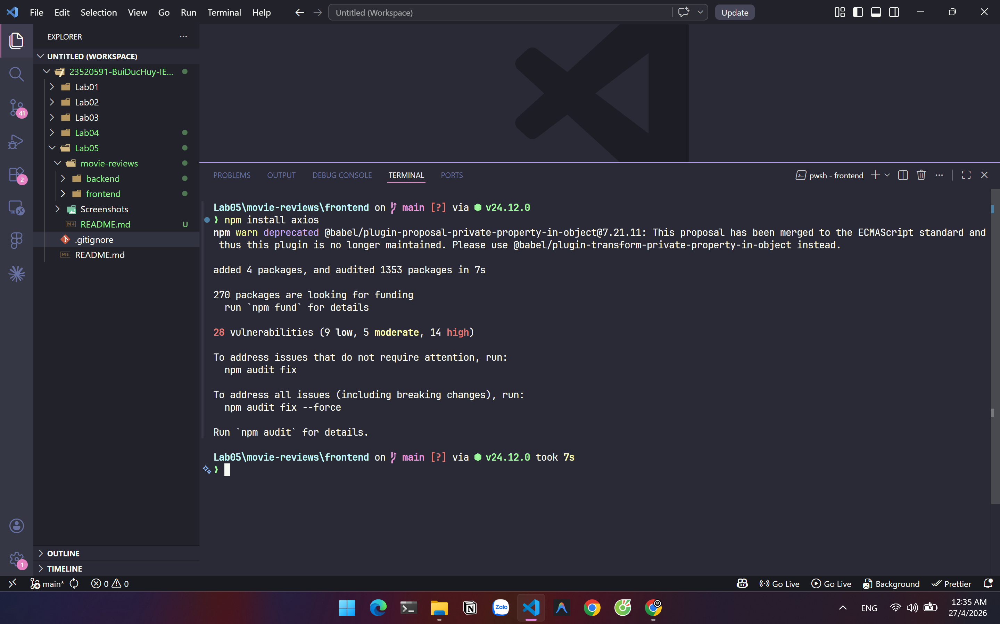

- Xây dựng class `MovieDataService` bên trong file `src/services/movies.js`.
- Tạo các phương thức: `getAll()`, `get(id)`, `find()`, `createReview()`, `updateReview()`, `deleteReview()`, `getRatings()` tương ứng gọi đến các API endpoint của backend.

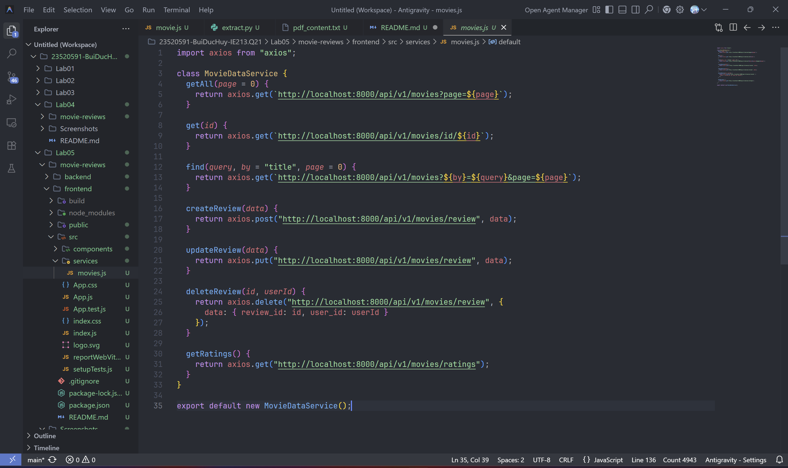


### 7.2. Bài 2: Xây dựng MoviesList Component
- Sử dụng Hook `useState` cho `movies`, `searchTitle`, `searchRating`, và `ratings`.
- Sử dụng Hook `useEffect` để tự động fetch danh sách phim và danh sách rating khi giao diện render xong.

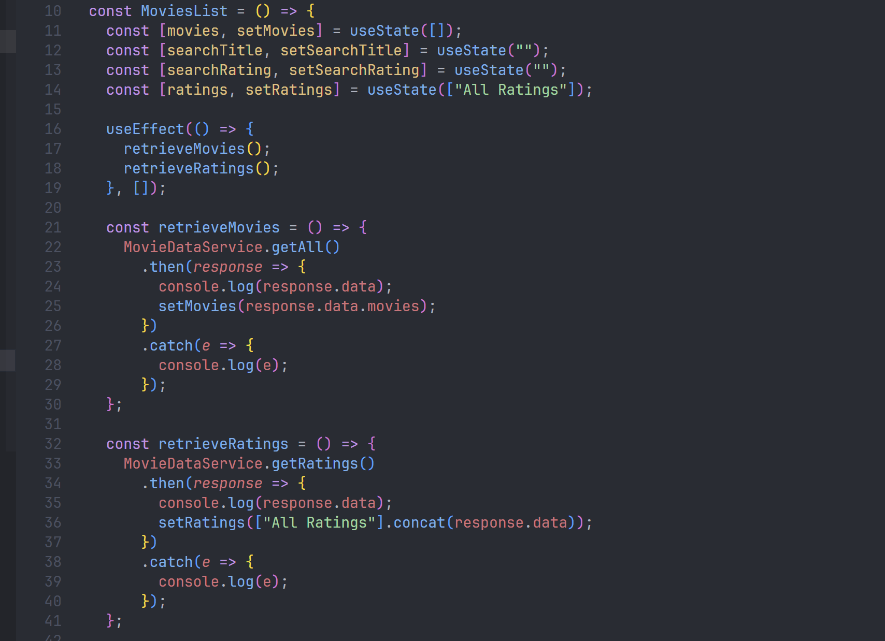

- Xây dựng form tìm kiếm phim theo Title và Form dropdown chọn tìm kiếm theo Rating.

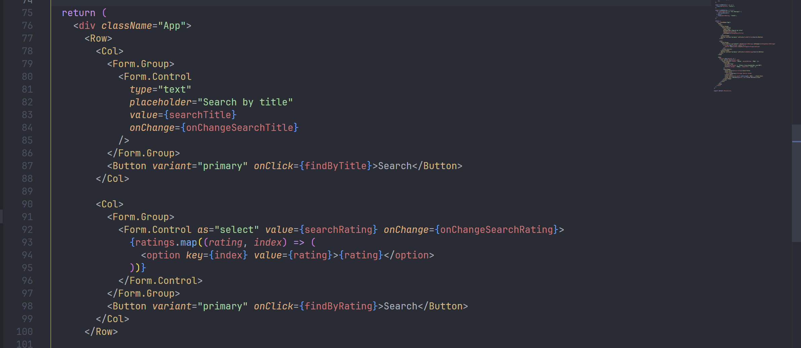

- Dùng component `<Card>` của React-Bootstrap để hiển thị lưới danh sách phim.

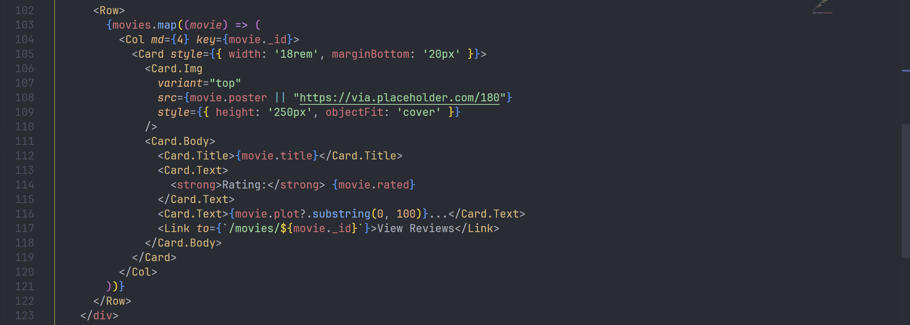

- Hiện thực 2 phương thức findByTitle() và findByRating() để tìm phim theo Title hoặc Rating.

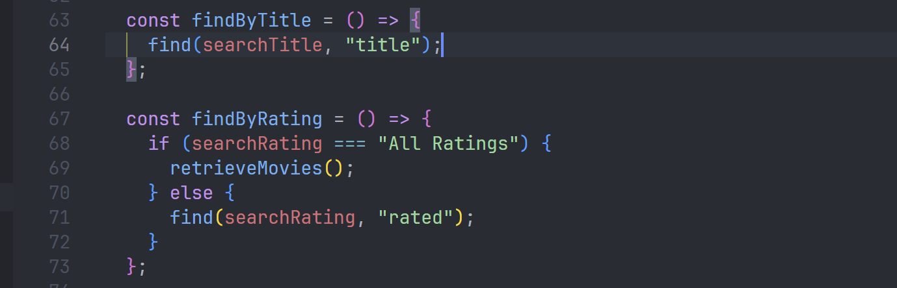

- Kết quả chạy ứng dụng:

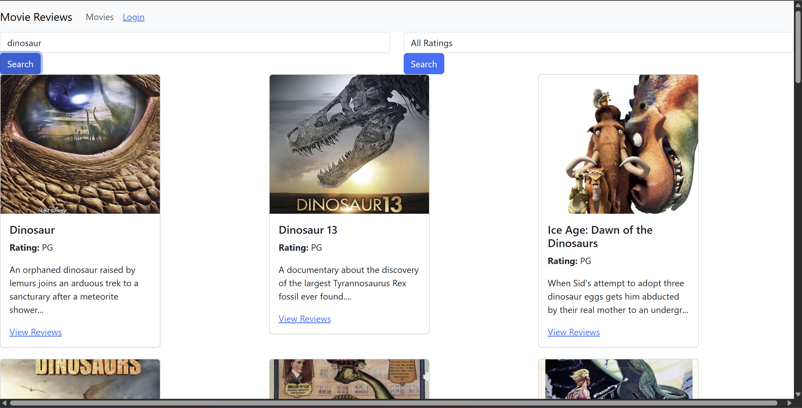

### 7.3. Bài 3: Hiển thị thông tin trang movie chi tiết
- Sử dụng `useState` và `useEffect` bên trong component `Movie` (file `movie.js`) để gọi hàm `MovieDataService` dựa theo `id` lấy từ URL.

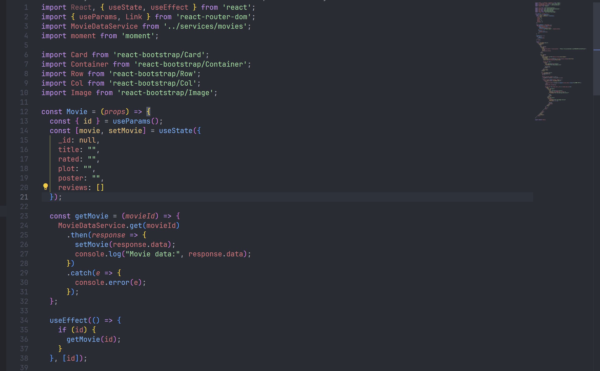

- Cập nhật giao diện JSX để hiển thị chi tiết Poster phim, Tiêu đề phim (Title), Rating, và Nội dung tóm tắt (Plot).

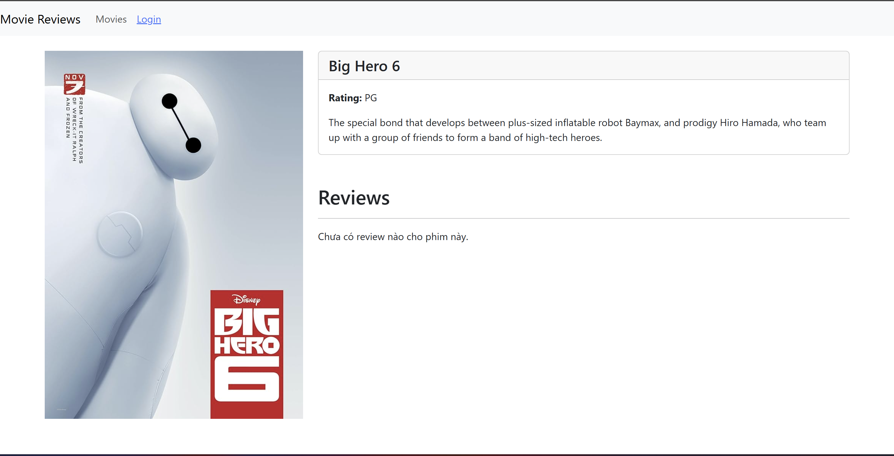


### 7.4. Bài 4: Hiển thị danh sách review và định dạng lại thời gian
- Lặp qua mảng `movie.reviews` bằng phương thức `map()` để hiển thị danh sách các bài đánh giá.

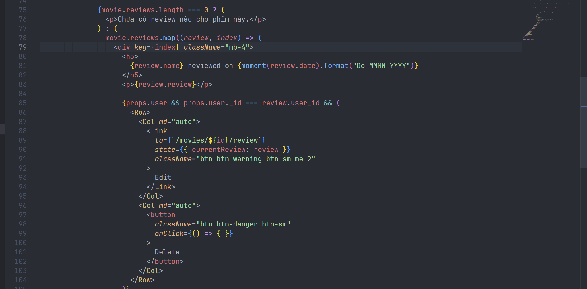

- Thêm các review bằng công cụ Postman

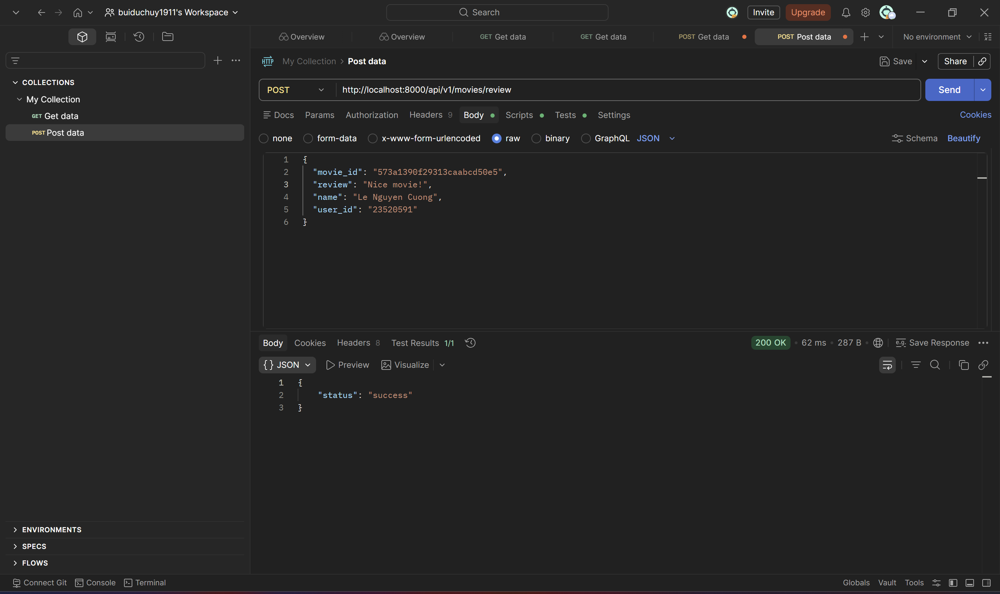

- Sử dụng thư viện `moment` (`npm install moment`) để định dạng lại chuỗi ngày tháng năm theo cú pháp: `{moment(review.date).format("Do MMMM YYYY")}`.

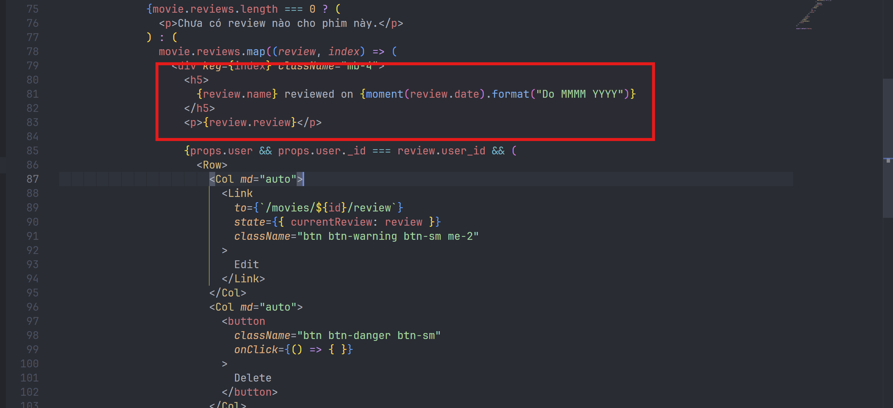

- Kết quả đạt được:

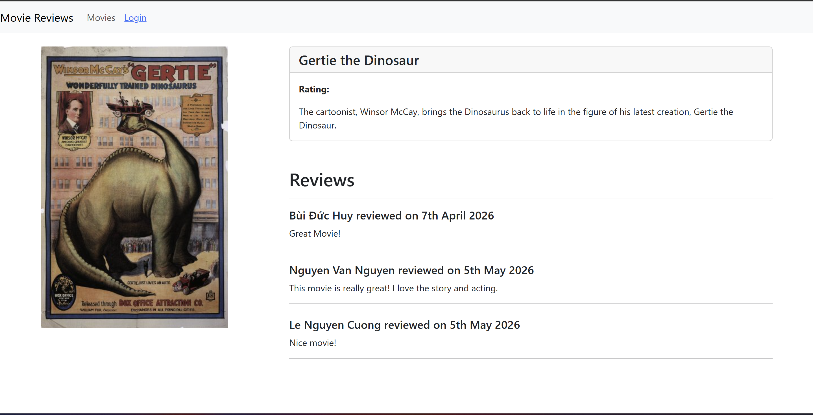

