# Lab 06: Xây dựng Frontend với ReactJS (tiếp theo)

---

## 1. Thông tin sinh viên
**Họ và tên:** Bùi Đức Huy  
**MSSV:** 23520591  
**Lớp:** IE213.Q21  
**Giảng viên:** ThS. Võ Tấn Khoa

---

## 2. Mục tiêu của bài lab
- Xây dựng tính năng Đăng nhập (Login) đơn giản và lưu thông tin người dùng.
- Hiện thực các tính năng **Thêm (Create)**, **Sửa (Update)** và **Xoá (Delete)** Review tương tác trực tiếp với Backend API.
- Bổ sung tính năng **Phân trang (Pagination)** cho danh sách phim và điều chỉnh lại cơ chế Tìm kiếm (Search) có hỗ trợ phân trang.

---

## 3. Công cụ và môi trường sử dụng
- **Ngôn ngữ & Framework**: JavaScript, React
- **Routing**: React Router V6 (`useNavigate`, `useLocation`, `useParams`)
- **Thư viện gọi API**: axios

---

## 4. Cấu trúc thư mục Lab06

```plaintext
Lab06/
├── README.md
├── Screenshots/
└── movie-reviews/
    ├── backend/
    └── frontend/
        ├── public/
        ├── src/
        │   ├── components/
        │   │   ├── add-review.js
        │   │   ├── login.js
        │   │   ├── movie.js
        │   │   └── movies-list.js
        │   ├── services/
        │   │   └── movies.js
        │   ├── App.js
        │   ├── index.js
        │   └── ...
        ├── package.json
        └── package-lock.json
```

---

## 5. Cách chạy chương trình

### Khởi động Backend
1. Di chuyển vào thư mục backend:
```bash
cd Lab06/movie-reviews/backend
```
2. Cài đặt thư viện (nếu chưa cài đặt) và chạy backend:
```bash
npm install
npm run dev
```

### Khởi động Frontend
1. Di chuyển vào thư mục frontend:
```bash
cd Lab06/movie-reviews/frontend
```
2. Cài đặt thư viện:
```bash
npm install
```
3. Chạy ứng dụng frontend:
```bash
npm start
```
4. Truy cập trình duyệt tại địa chỉ: `http://localhost:3000`

---

## 6. Kết quả thực hiện
- Người dùng có thể đăng nhập giả lập bằng Form Login.
- Sau khi đăng nhập, người dùng có quyền Thêm bài Đánh giá cho phim. Đồng thời, có thể Sửa hoặc Xoá các bài Đánh giá do chính mình tạo ra.
- Màn hình trang chủ hiển thị lưới danh sách phim đã được áp dụng phân trang, kèm theo nút bấm chuyển trang ở cuối danh sách.
- Chức năng tìm kiếm kết hợp hoàn hảo với phân trang (mỗi chế độ tìm kiếm có danh sách trang riêng).

---

## 7. Các công việc và nội dung đã thực hiện

### 7.1. Bài 1: Thêm và Sửa Review

**a) Tạo login component**
- Xây dựng component `Login` chứa Form nhập `username` và `id`. Hàm `login()` sẽ gọi prop được truyền từ `App.js` để lưu trạng thái người dùng, sau đó gọi Hook `useNavigate()` của React Router V6 để điều hướng về lại trang Home `/`.

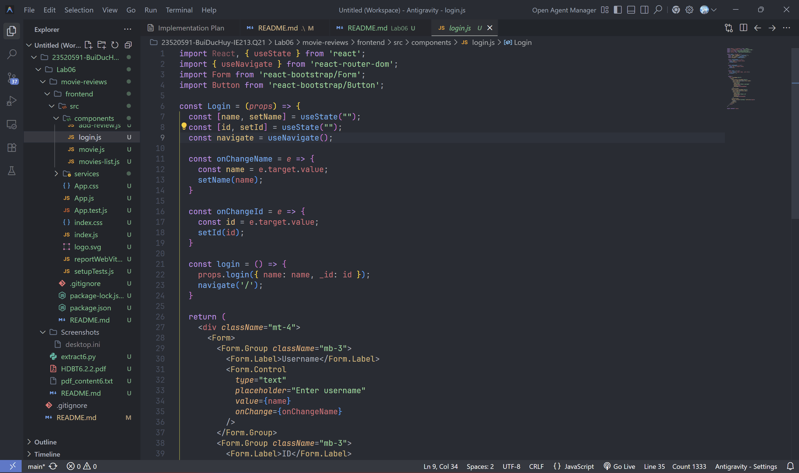

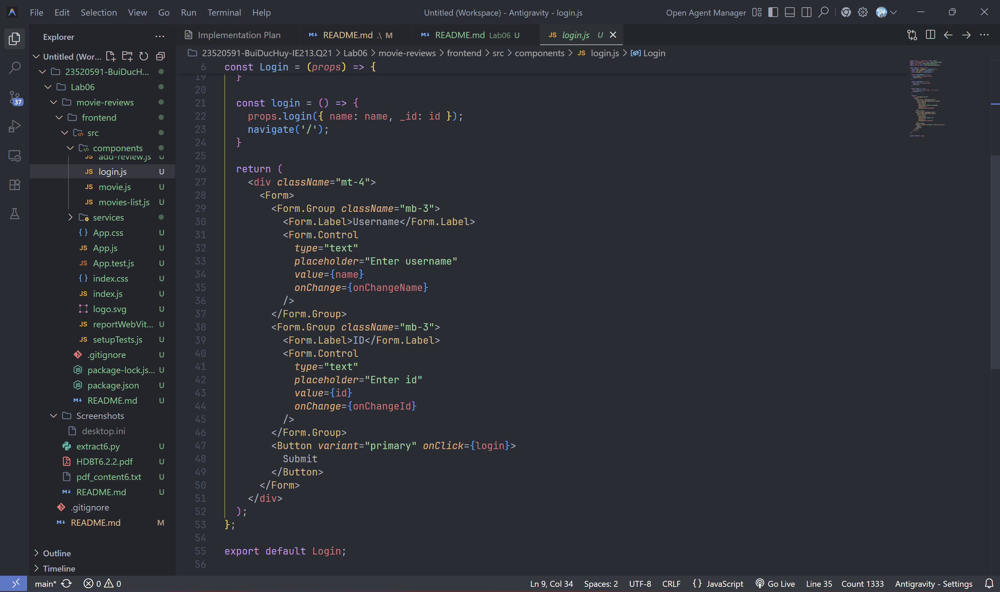

- Màn hình form Login:

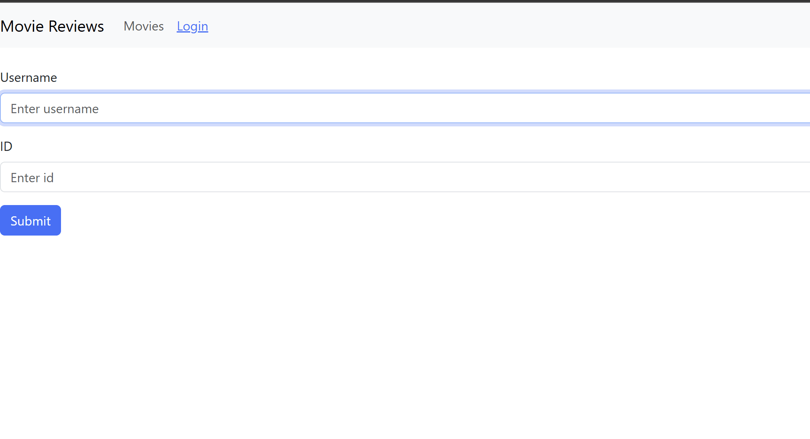

**b) Chức năng Thêm review**
- Tại file `add-review.js`, khởi tạo state `review` và `submitted`.

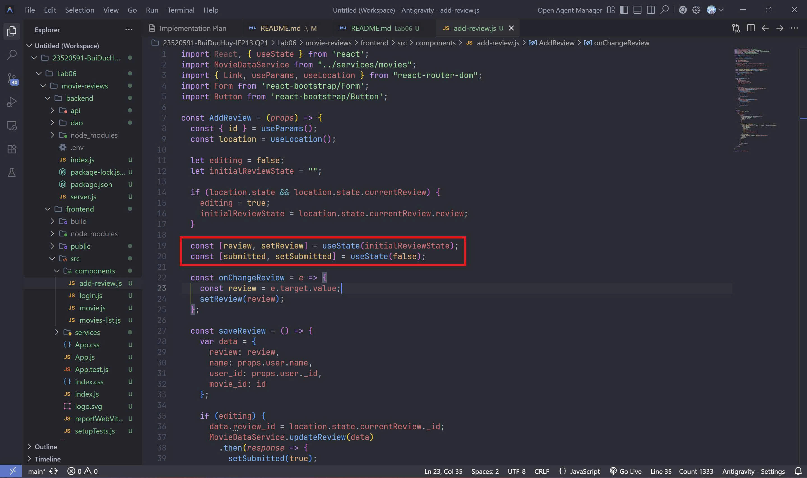

- Viết hàm `saveReview` để lấy `user_id`, `name`, `movie_id` gom vào thành object `data` và gọi API `MovieDataService.createReview(data)`. Sau khi gọi xong đổi state `submitted` sang true để hiện thông báo thành công.

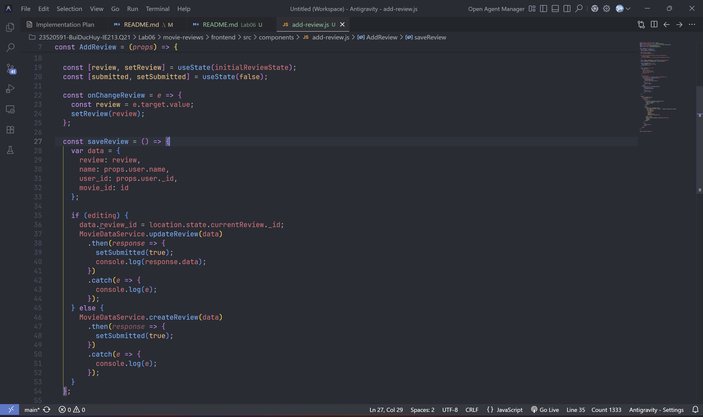

- Màn hình sau khi thêm review thành công:

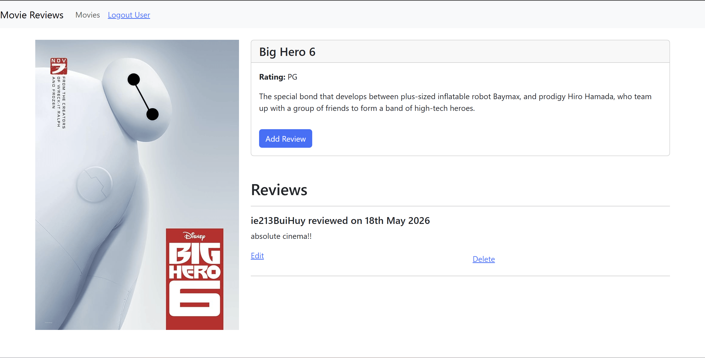

**c) Chức năng Sửa review**
- Mở rộng chức năng trên file `add-review.js`: Sử dụng `useLocation()` để nhận prop `currentReview` truyền qua từ component `movie.js` thông qua nút Edit.
- Cờ hiệu `editing` được bật lên, nội dung trong ô input tự động điền sẵn bài review cũ. Hàm `saveReview` được chỉnh sửa để gọi api `updateReview(data)` nếu người dùng đang ở chế độ chỉnh sửa.

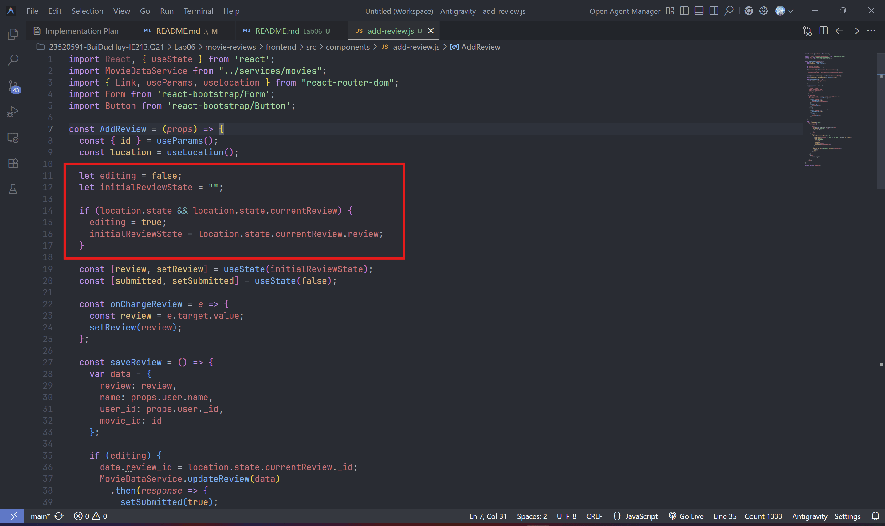

- Màn hình chỉnh sửa review:

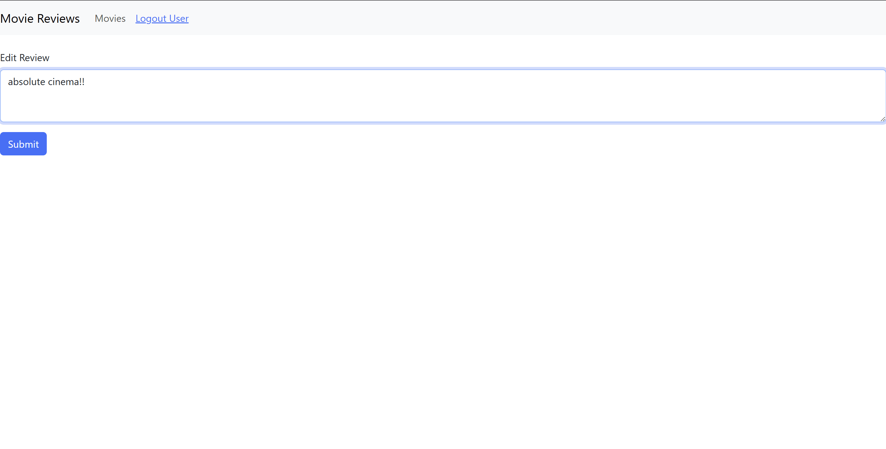


### 7.2. Bài 2: Xoá review
- Chỉnh sửa file `movie.js`, bổ sung hàm `deleteReview(reviewId, index)` gọi `MovieDataService.deleteReview`.
- Thay vì fetch lại API toàn bộ phim, sử dụng hàm `splice()` mảng để cắt bỏ review đó khỏi giao diện React và cập nhật lại state, giúp giao diện phản hồi tức thì.

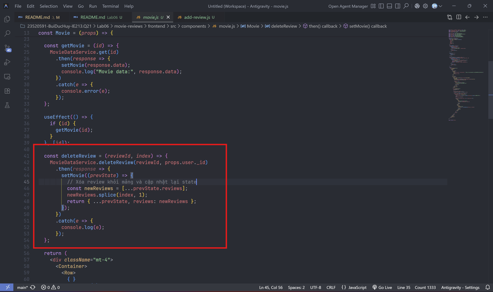

- Ráp sự kiện `onClick` vào nút Delete.

*(Chèn ảnh màn hình nhấn nút xoá review và kết quả sau khi xoá)*


### 7.3. Bài 3: Lấy dữ liệu cho trang tiếp theo (Phân trang)

**a) Xử lý phân trang cho hàm getAll()**
- Trong component `movies-list.js`, tạo 2 state `currentPage` và `entriesPerPage`.

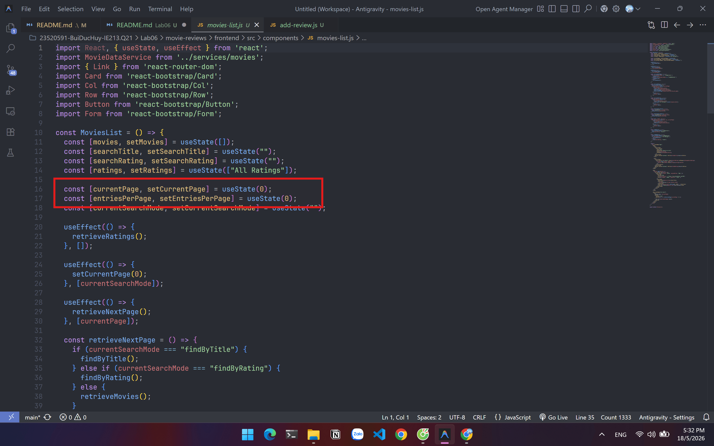

- Điều chỉnh hàm `useEffect` lắng nghe theo biến `currentPage`. Mỗi khi biến này tăng, hàm `retrieveMovies()` sẽ gửi API lấy trang kế tiếp dựa vào tham số page.

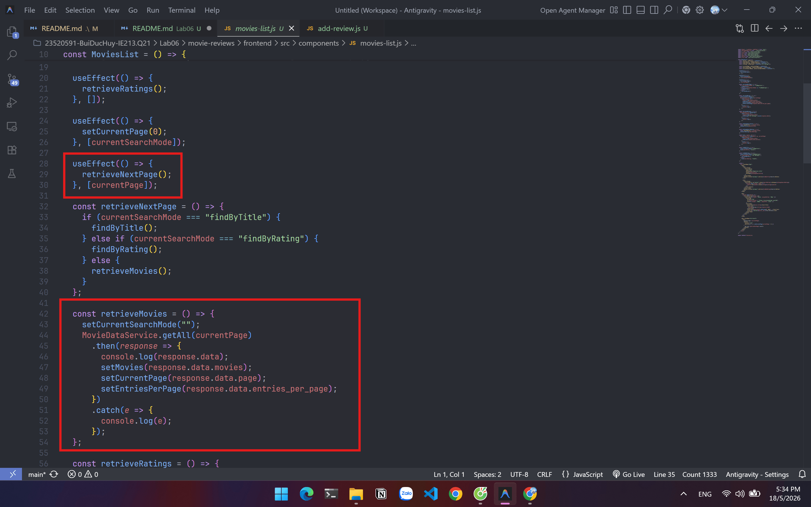

- Hiển thị Text "Showing page" và nút bấm chuyển sang trang mới ở phía dưới danh sách phim.

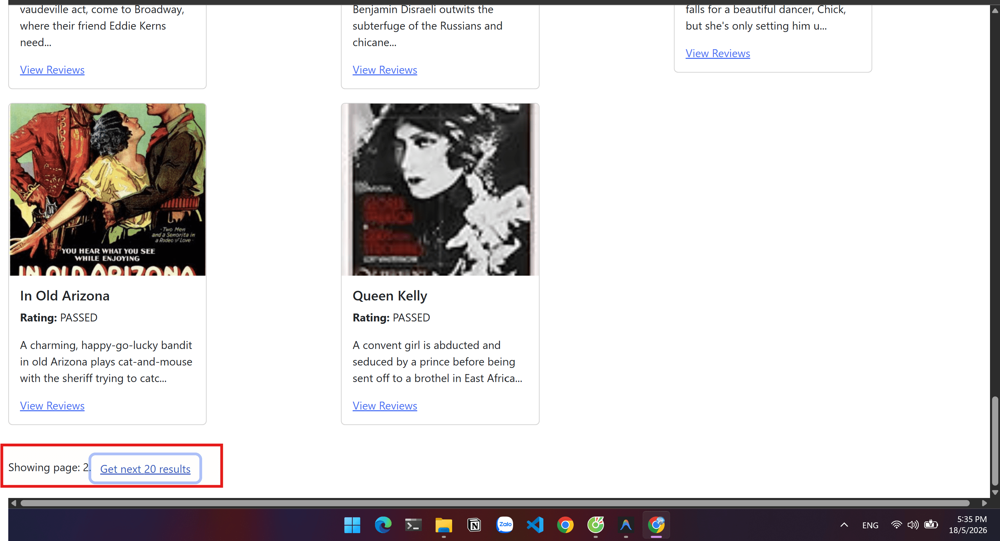

**b) Xử lý phân trang cho hàm find()**
- Tạo thêm biến `currentSearchMode` để theo dõi người dùng đang xem trang Tất cả, tìm theo Tựa đề hay tìm theo Hạng tuổi.
- Thay đổi `useEffect` để Reset `currentPage = 0` mỗi khi người dùng bắt đầu thay đổi chế độ tìm kiếm mới.

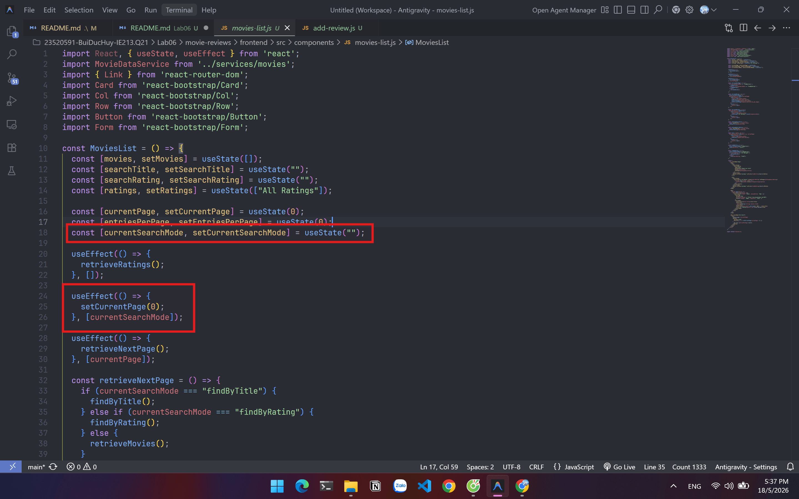

- Viết hàm `retrieveNextPage()` dùng cấu trúc if-else để tuỳ thuộc vào `currentSearchMode` mà sẽ gọi hàm tương ứng.

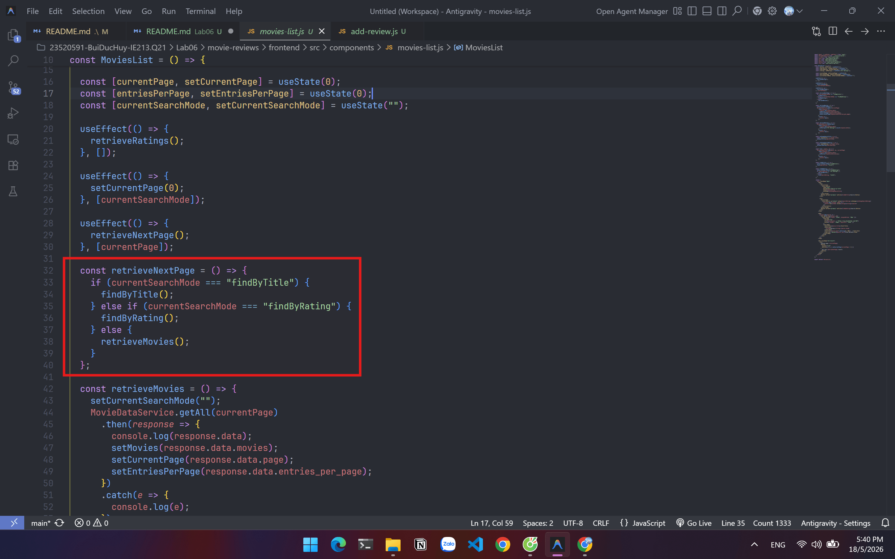

- Màn hình giao diện kết quả sau khi lọc theo Rating "R" và bấm chuyển sang trang kế tiếp:

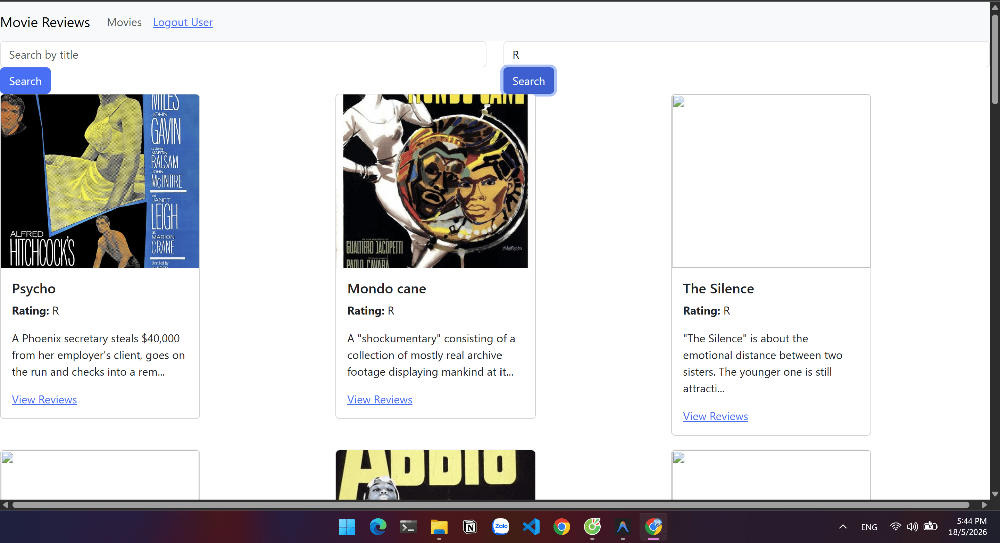

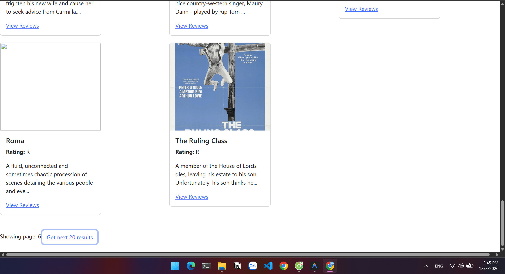

---
